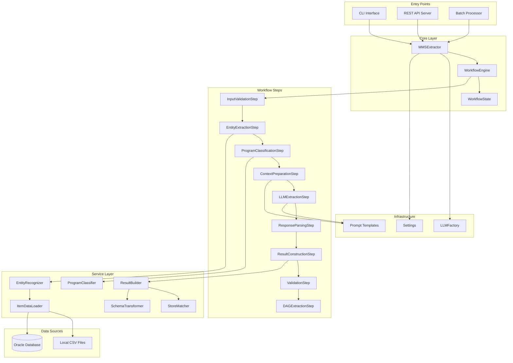
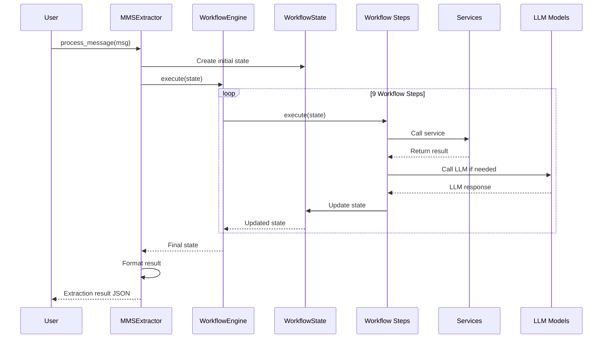
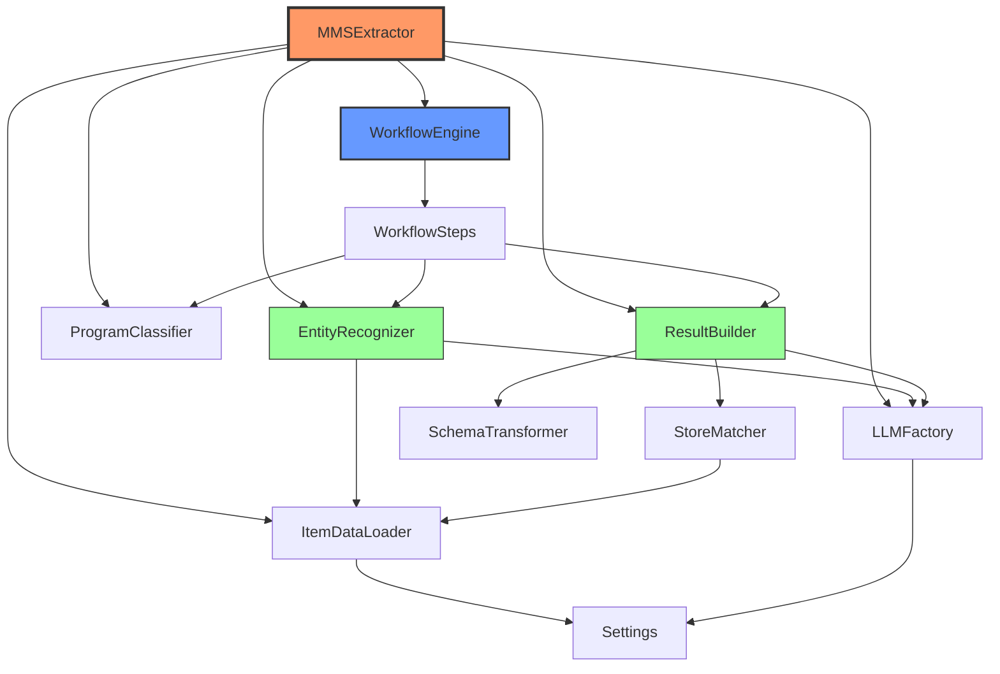

# MMS Extractor - 아키텍처 문서

## 📋 목차

1. [시스템 개요](#시스템-개요)
2. [컴포넌트 다이어그램](#컴포넌트-다이어그램)
3. [데이터 흐름](#데이터-흐름)
4. [의존성 그래프](#의존성-그래프)
5. [주요 설계 결정](#주요-설계-결정)

---

## 시스템 개요

MMS Extractor는 MMS 광고 메시지에서 구조화된 정보를 추출하는 AI 기반 시스템입니다.

### 핵심 특징
- **Workflow 기반 아키텍처**: 9단계 처리 파이프라인
- **서비스 레이어 분리**: 독립적인 비즈니스 로직 서비스
- **다중 LLM 지원**: OpenAI, Anthropic, Gemini, AX 등
- **유연한 데이터 소스**: 로컬 CSV 또는 Oracle DB

---

## 컴포넌트 다이어그램

### 전체 시스템 아키텍처



### 레이어별 책임

| 레이어 | 책임 | 주요 컴포넌트 |
|--------|------|---------------|
| **Entry Points** | 사용자 인터페이스 제공 | CLI, API, Batch |
| **Core Layer** | 전체 프로세스 오케스트레이션 | MMSExtractor, WorkflowEngine |
| **Workflow Steps** | 단계별 처리 로직 | 9개 Step 클래스 |
| **Service Layer** | 독립적인 비즈니스 로직 | 6개 Service 클래스 |
| **Infrastructure** | 공통 기능 및 설정 | Factory, Config, Utils |
| **Data Sources** | 데이터 저장소 | CSV, Oracle DB |

---

## 데이터 흐름

### Workflow 단계별 데이터 흐름



### 데이터 변환 과정

```mermaid
graph LR
    A[Original MMS Text] --> B[Validated Message]
    B --> C[Kiwi Entities]
    C --> D[Matched Products]
    D --> E[RAG Context]
    E --> F[LLM Prompt]
    F --> G[LLM Response JSON]
    G --> H[Parsed Objects]
    H --> I[Schema Transform]
    I --> J[Final Result JSON]
    
    style A fill:#f9f,stroke:#333
    style J fill:#9f9,stroke:#333
```



### 주요 데이터 구조

#### WorkflowState
```python
@dataclass
class WorkflowState:
    # 입력
    mms_msg: str                    # 원본 메시지
    extractor: 'MMSExtractor'       # 추출기 인스턴스
    
    # 중간 결과
    msg: str                        # 검증된 메시지
    entities_from_kiwi: List        # Kiwi 추출 엔티티
    pgm_info: Dict                  # 프로그램 정보
    rag_context: str                # RAG 컨텍스트
    llm_response: str               # LLM 응답
    json_objects: List[Dict]        # 파싱된 객체
    
    # 최종 결과
    final_result: Dict              # 최종 추출 결과
    entity_dag: List[str]           # DAG 엣지 (선택적)
    
    # 메타데이터
    is_fallback: bool = False       # 폴백 여부
    error_message: str = ""         # 에러 메시지
```

#### 최종 결과 스키마
```json
{
  "ext_result": {
    "title": "제목",
    "sales_script": "판매 스크립트",
    "purpose": ["목적1", "목적2"],
    "product": [
      {
        "item_nm": "상품명",
        "item_id": ["ID1", "ID2"],
        "item_name_in_msg": ["메시지 내 표현"],
        "expected_action": ["구매", "가입"]
      }
    ],
    "channel": [...],
    "pgm": [...],
    "offer": {...},
    "entity_dag": ["(엔티티1) -[관계]-> (엔티티2)"]
  },
  "raw_result": {...},
  "metadata": {...}
}
```

---

## 의존성 그래프

### 서비스 간 의존성



### 의존성 레벨

| 레벨 | 컴포넌트 | 의존하는 컴포넌트 |
|------|----------|-------------------|
| **Level 0** | Settings | 없음 (최하위) |
| **Level 1** | LLMFactory, ItemDataLoader | Settings |
| **Level 2** | StoreMatcher, SchemaTransformer | ItemDataLoader |
| **Level 3** | EntityRecognizer, ProgramClassifier | LLMFactory, ItemDataLoader |
| **Level 4** | ResultBuilder | StoreMatcher, SchemaTransformer, LLMFactory |
| **Level 5** | WorkflowSteps | EntityRecognizer, ProgramClassifier, ResultBuilder |
| **Level 6** | WorkflowEngine | WorkflowSteps |
| **Level 7** | MMSExtractor | 모든 컴포넌트 (최상위) |

---

## 주요 설계 결정

### 1. Workflow Pattern 채택

**결정**: 처리 로직을 9개의 독립적인 Step으로 분리

**이유**:
- ✅ 각 단계의 책임이 명확함
- ✅ 새로운 단계 추가가 용이
- ✅ 단계별 독립 테스트 가능
- ✅ 에러 발생 시 어느 단계에서 실패했는지 명확

**트레이드오프**:
- ⚠️ 초기 설정 복잡도 증가
- ⚠️ 단계 간 데이터 전달 오버헤드

### 2. Service Layer 분리

**결정**: 비즈니스 로직을 독립적인 서비스 클래스로 분리

**이유**:
- ✅ 단일 책임 원칙 준수
- ✅ 재사용성 향상
- ✅ 테스트 용이성
- ✅ 의존성 주입으로 유연성 확보

**트레이드오프**:
- ⚠️ 클래스 수 증가
- ⚠️ 초기 학습 곡선

### 3. Config 중앙화

**결정**: 모든 설정을 `config/settings.py`에 집중

**이유**:
- ✅ 설정 변경 시 한 곳만 수정
- ✅ 환경별 설정 관리 용이
- ✅ 타입 안정성 (dataclass 사용)
- ✅ 기본값 명시적 관리

**트레이드오프**:
- ⚠️ 설정 파일이 커질 수 있음
- ⚠️ 순환 import 주의 필요

### 4. LLM Factory Pattern

**결정**: LLM 모델 생성을 Factory로 중앙화

**이유**:
- ✅ 순환 의존성 제거
- ✅ 모델 추가/변경 용이
- ✅ 일관된 모델 초기화
- ✅ 테스트 시 Mock 주입 용이

**트레이드오프**:
- ⚠️ 간접 레이어 추가

### 5. 데이터 소스 추상화

**결정**: 로컬 CSV와 Oracle DB를 동일한 인터페이스로 제공

**이유**:
- ✅ 개발/운영 환경 분리
- ✅ 테스트 용이성
- ✅ 데이터 소스 전환 용이

**트레이드오프**:
- ⚠️ 두 소스 간 스키마 일관성 유지 필요

### 6. Prompt 외부화

**결정**: 프롬프트를 별도 모듈로 분리

**이유**:
- ✅ 프롬프트 수정이 코드 변경 없이 가능
- ✅ 프롬프트 버전 관리 용이
- ✅ A/B 테스트 가능

**트레이드오프**:
- ⚠️ 프롬프트와 파싱 로직 간 동기화 필요

---

## 성능 고려사항

### 병목 지점

1. **LLM API 호출** (가장 큰 병목)
   - 평균 응답 시간: 5-15초
   - 완화 방법: 비동기 처리, 배치 처리

2. **데이터베이스 쿼리**
   - 초기 데이터 로딩: 2-5초
   - 완화 방법: 전역 캐싱, 인덱스 최적화

3. **임베딩 계산**
   - 프로그램 분류 임베딩: 1-2초
   - 완화 방법: 사전 계산 및 캐싱

### 확장성 전략

- **수평 확장**: API 서버 다중 인스턴스
- **배치 처리**: 멀티프로세싱 지원
- **캐싱**: 전역 추출기 재사용

---

## 보안 고려사항

### API 키 관리
- 환경 변수로 관리 (`.env`)
- 코드에 하드코딩 금지
- 로그에 마스킹 처리

### 데이터 보호
- DB 연결 정보 암호화
- 민감 정보 로깅 방지
- CORS 설정으로 API 접근 제어

---

*작성일: 2025-12-16*  
*버전: 1.0*  
