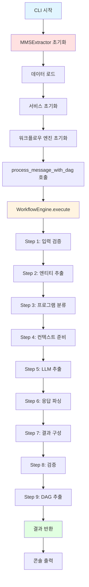

# MMS Extractor 실행 흐름 문서

이 문서는 MMS Extractor를 CLI 또는 API를 통해 실행할 때 호출되는 모든 클래스와 함수를 순서대로 정리합니다.

---

## 목차
1. [CLI 실행 흐름](#cli-실행-흐름)
2. [API 실행 흐름](#api-실행-흐름)
3. [공통 실행 흐름](#공통-실행-흐름)

---

# CLI 실행 흐름

## 명령어
```bash
python apps/cli.py --offer-data-source local --extract-entity-dag
```

## CLI 실행 흐름 개요

CLI 명령어 실행 시 호출되는 모든 클래스와 함수를 순서대로 정리합니다.

---

## 1단계: CLI 진입점

### 1.1 [`main()`](file:///Users/yongwook/workspace/AgenticWorkflow/mms_extractor_exp/apps/cli.py#L52)
- **파일**: [apps/cli.py](file:///Users/yongwook/workspace/AgenticWorkflow/mms_extractor_exp/apps/cli.py)
- **입력**: 없음 (커맨드라인 인자 파싱)
- **출력**: 없음 (결과를 콘솔에 출력)
- **주요 작업**:
  - 커맨드라인 인자 파싱 (`argparse`)
  - 로그 레벨 설정
  - `MMSExtractor` 인스턴스 생성
  - 메시지 처리 실행

---

## 2단계: MMSExtractor 초기화

### 2.1 [`MMSExtractor.__init__()`](file:///Users/yongwook/workspace/AgenticWorkflow/mms_extractor_exp/core/mms_extractor.py#L347)
- **파일**: [core/mms_extractor.py](file:///Users/yongwook/workspace/AgenticWorkflow/mms_extractor_exp/core/mms_extractor.py)
- **입력**: 
  - `offer_info_data_src` = 'local'
  - `extract_entity_dag` = True
  - 기타 설정 매개변수
- **출력**: `MMSExtractor` 인스턴스
- **주요 작업**:
  - 기본 설정 적용
  - 환경변수 로드
  - 디바이스, LLM, 임베딩 모델, Kiwi, 데이터 초기화
  - 서비스 및 워크플로우 엔진 초기화

#### 2.1.1 [`_set_default_config()`](file:///Users/yongwook/workspace/AgenticWorkflow/mms_extractor_exp/core/mms_extractor.py#L472)
- **입력**: `model_path`, `data_dir`, `product_info_extraction_mode`, `entity_extraction_mode`, `offer_info_data_src`, `llm_model`, `entity_llm_model`, `extract_entity_dag`, `entity_extraction_context_mode`
- **출력**: 없음 (인스턴스 속성 설정)
- **주요 작업**: 기본 설정값 적용

#### 2.1.2 [`_initialize_device()`](file:///Users/yongwook/workspace/AgenticWorkflow/mms_extractor_exp/core/mms_extractor.py#L496)
- **입력**: 없음
- **출력**: 없음 (`self.device` 설정)
- **주요 작업**: GPU/CPU 디바이스 선택

#### 2.1.3 [`_initialize_llm()`](file:///Users/yongwook/workspace/AgenticWorkflow/mms_extractor_exp/core/mms_extractor.py#L507)
- **입력**: 없음
- **출력**: 없음 (`self.llm_model` 설정)
- **주요 작업**: LLM 모델 초기화 (ChatOpenAI)

#### 2.1.4 [`_initialize_embedding_model()`](file:///Users/yongwook/workspace/AgenticWorkflow/mms_extractor_exp/core/mms_extractor.py#L546)
- **입력**: 없음
- **출력**: 없음 (`self.emb_model` 설정)
- **주요 작업**: SentenceTransformer 임베딩 모델 로드

#### 2.1.5 [`_initialize_kiwi()`](file:///Users/yongwook/workspace/AgenticWorkflow/mms_extractor_exp/core/mms_extractor.py#L583)
- **입력**: 없음
- **출력**: 없음 (`self.kiwi` 설정)
- **주요 작업**: Kiwi 형태소 분석기 초기화

#### 2.1.6 [`_load_data()`](file:///Users/yongwook/workspace/AgenticWorkflow/mms_extractor_exp/core/mms_extractor.py#L602)
- **입력**: 없음
- **출력**: 없음 (데이터 로드 및 인스턴스 속성 설정)
- **주요 작업**: 상품, 프로그램, 조직 데이터 로드

##### 2.1.6.1 [`_load_item_data()`](file:///Users/yongwook/workspace/AgenticWorkflow/mms_extractor_exp/core/mms_extractor.py#L663)
- **입력**: 없음
- **출력**: 없음 (`self.item_pdf_all`, `self.alias_pdf_raw` 설정)
- **주요 작업**: ItemDataLoader를 통한 상품 정보 로드

###### 2.1.6.1.1 [`ItemDataLoader.load_and_prepare_items()`](file:///Users/yongwook/workspace/AgenticWorkflow/mms_extractor_exp/services/item_data_loader.py#L529)
- **파일**: [services/item_data_loader.py](file:///Users/yongwook/workspace/AgenticWorkflow/mms_extractor_exp/services/item_data_loader.py)
- **입력**: `offer_data_path`, `alias_rules_path`, `output_path`, `data_source`
- **출력**: `(item_pdf_all, alias_pdf)` - 전처리된 상품 데이터와 별칭 규칙
- **주요 작업**: 상품 데이터 로드 및 전처리 파이프라인 실행
  1. [`load_raw_data()`](file:///Users/yongwook/workspace/AgenticWorkflow/mms_extractor_exp/services/item_data_loader.py#L169) - CSV에서 원시 데이터 로드
  2. [`normalize_columns()`](file:///Users/yongwook/workspace/AgenticWorkflow/mms_extractor_exp/services/item_data_loader.py#L216) - 컬럼명 정규화
  3. [`filter_by_domain()`](file:///Users/yongwook/workspace/AgenticWorkflow/mms_extractor_exp/services/item_data_loader.py#L247) - 도메인 필터링
  4. [`load_alias_rules()`](file:///Users/yongwook/workspace/AgenticWorkflow/mms_extractor_exp/services/item_data_loader.py#L269) - 별칭 규칙 로드
  5. [`expand_build_aliases()`](file:///Users/yongwook/workspace/AgenticWorkflow/mms_extractor_exp/services/item_data_loader.py#L297) - Build 타입 별칭 확장
  6. [`create_bidirectional_aliases()`](file:///Users/yongwook/workspace/AgenticWorkflow/mms_extractor_exp/services/item_data_loader.py#L334) - 양방향 별칭 추가
  7. [`apply_cascading_alias_rules()`](file:///Users/yongwook/workspace/AgenticWorkflow/mms_extractor_exp/services/item_data_loader.py#L353) - 별칭 규칙 연쇄 적용
  8. [`add_user_defined_entities()`](file:///Users/yongwook/workspace/AgenticWorkflow/mms_extractor_exp/services/item_data_loader.py#L460) - 사용자 정의 엔티티 추가
  9. [`add_domain_name_column()`](file:///Users/yongwook/workspace/AgenticWorkflow/mms_extractor_exp/services/item_data_loader.py#L486) - 도메인명 컬럼 추가
  10. [`filter_test_items()`](file:///Users/yongwook/workspace/AgenticWorkflow/mms_extractor_exp/services/item_data_loader.py#L511) - TEST 항목 필터링

##### 2.1.6.2 [`_load_stopwords()`](file:///Users/yongwook/workspace/AgenticWorkflow/mms_extractor_exp/core/mms_extractor.py#L698)
- **입력**: 없음
- **출력**: 없음 (`self.stop_item_names` 설정)
- **주요 작업**: 정지어 목록 로드

##### 2.1.6.3 [`_register_items_in_kiwi()`](file:///Users/yongwook/workspace/AgenticWorkflow/mms_extractor_exp/core/mms_extractor.py#L707)
- **입력**: 없음
- **출력**: 없음
- **주요 작업**: Kiwi에 상품명들을 고유명사로 등록

##### 2.1.6.4 [`_load_program_data()`](file:///Users/yongwook/workspace/AgenticWorkflow/mms_extractor_exp/core/mms_extractor.py#L746)
- **입력**: 없음
- **출력**: 없음 (`self.pgm_pdf`, `self.clue_embeddings` 설정)
- **주요 작업**: 프로그램 분류 정보 로드 및 임베딩 생성

##### 2.1.6.5 [`_load_organization_data()`](file:///Users/yongwook/workspace/AgenticWorkflow/mms_extractor_exp/core/mms_extractor.py#L786)
- **입력**: 없음
- **출력**: 없음 (`self.org_pdf` 설정)
- **주요 작업**: 조직/매장 정보 로드

#### 2.1.7 서비스 초기화

##### 2.1.7.1 `EntityRecognizer` 초기화
- **파일**: [services/entity_recognizer.py](file:///Users/yongwook/workspace/AgenticWorkflow/mms_extractor_exp/services/entity_recognizer.py)
- **입력**: `kiwi`, `item_pdf_all`, `stop_item_names`, `llm_model`, `alias_pdf_raw`, `entity_extraction_mode`
- **출력**: `EntityRecognizer` 인스턴스

##### 2.1.7.2 `ProgramClassifier` 초기화
- **파일**: [services/program_classifier.py](file:///Users/yongwook/workspace/AgenticWorkflow/mms_extractor_exp/services/program_classifier.py)
- **입력**: `emb_model`, `pgm_pdf`, `clue_embeddings`, `num_cand_pgms`
- **출력**: `ProgramClassifier` 인스턴스

##### 2.1.7.3 `StoreMatcher` 초기화
- **파일**: [services/store_matcher.py](file:///Users/yongwook/workspace/AgenticWorkflow/mms_extractor_exp/services/store_matcher.py)
- **입력**: `org_pdf`
- **출력**: `StoreMatcher` 인스턴스

##### 2.1.7.4 `ResultBuilder` 초기화
- **파일**: [services/result_builder.py](file:///Users/yongwook/workspace/AgenticWorkflow/mms_extractor_exp/services/result_builder.py)
- **입력**: `entity_recognizer`, `store_matcher`, `alias_pdf_raw`, `stop_item_names`, `num_cand_pgms`, `entity_extraction_mode`, `llm_factory`, `entity_llm_model_name`, `entity_extraction_context_mode`
- **출력**: `ResultBuilder` 인스턴스

#### 2.1.8 워크플로우 엔진 초기화

##### 2.1.8.1 `WorkflowEngine` 초기화
- **파일**: [core/workflow_core.py](file:///Users/yongwook/workspace/AgenticWorkflow/mms_extractor_exp/core/workflow_core.py)
- **입력**: `name` = "MMS Extraction Workflow"
- **출력**: `WorkflowEngine` 인스턴스
- **주요 작업**: 9개 워크플로우 단계 등록
  1. `InputValidationStep`
  2. `EntityExtractionStep`
  3. `ProgramClassificationStep`
  4. `ContextPreparationStep`
  5. `LLMExtractionStep`
  6. `ResponseParsingStep`
  7. `ResultConstructionStep`
  8. `ValidationStep`
  9. `DAGExtractionStep` (extract_entity_dag=True일 때만)

---

## 3단계: 메시지 처리

### 3.1 [`process_message_with_dag()`](file:///Users/yongwook/workspace/AgenticWorkflow/mms_extractor_exp/core/mms_extractor.py#L1170)
- **파일**: [core/mms_extractor.py](file:///Users/yongwook/workspace/AgenticWorkflow/mms_extractor_exp/core/mms_extractor.py)
- **입력**: `extractor`, `message`, `extract_dag`, `message_id`
- **출력**: `result` - 처리 결과 딕셔너리
- **주요 작업**:
  - 프롬프트 저장소 초기화
  - `extractor.process_message()` 호출
  - DAG 추출 (필요 시)

#### 3.1.1 [`MMSExtractor.process_message()`](file:///Users/yongwook/workspace/AgenticWorkflow/mms_extractor_exp/core/mms_extractor.py#L1000)
- **입력**: `message`, `message_id`
- **출력**: `result` - 처리 결과 딕셔너리
- **주요 작업**: 워크플로우 엔진을 통한 9단계 처리 실행

##### 3.1.1.1 워크플로우 실행: [`WorkflowEngine.execute()`](file:///Users/yongwook/workspace/AgenticWorkflow/mms_extractor_exp/core/workflow_core.py)
- **파일**: [core/workflow_core.py](file:///Users/yongwook/workspace/AgenticWorkflow/mms_extractor_exp/core/workflow_core.py)
- **입력**: `initial_state` - WorkflowState 객체
- **출력**: `final_state` - 처리 완료된 WorkflowState 객체
- **주요 작업**: 등록된 모든 단계를 순차적으로 실행

---

## 4단계: 워크플로우 단계별 실행

### Step 1: [`InputValidationStep.execute()`](file:///Users/yongwook/workspace/AgenticWorkflow/mms_extractor_exp/core/mms_workflow_steps.py#L206)
- **파일**: [core/mms_workflow_steps.py](file:///Users/yongwook/workspace/AgenticWorkflow/mms_extractor_exp/core/mms_workflow_steps.py)
- **입력**: `state` (WorkflowState)
- **출력**: 없음 (state 업데이트)
- **주요 작업**:
  - 메시지 유효성 검증
  - 메시지 정보 로깅
  - 추출기 설정 로깅

### Step 2: [`EntityExtractionStep.execute()`](file:///Users/yongwook/workspace/AgenticWorkflow/mms_extractor_exp/core/mms_workflow_steps.py#L266)
- **입력**: `state`
- **출력**: 없음 (state에 `entities_from_kiwi`, `cand_item_list`, `extra_item_pdf` 추가)
- **주요 작업**:
  - Kiwi 형태소 분석을 통한 NNP 태그 추출
  - 임베딩 기반 유사도 매칭
  - 후보 상품 목록 생성

#### 2.1 [`EntityRecognizer.extract_entities()`](file:///Users/yongwook/workspace/AgenticWorkflow/mms_extractor_exp/services/entity_recognizer.py)
- **파일**: [services/entity_recognizer.py](file:///Users/yongwook/workspace/AgenticWorkflow/mms_extractor_exp/services/entity_recognizer.py)
- **입력**: `msg`
- **출력**: `(entities_from_kiwi, cand_item_list, extra_item_pdf)`
- **주요 작업**: Kiwi + 임베딩 기반 엔티티 추출

### Step 3: [`ProgramClassificationStep.execute()`](file:///Users/yongwook/workspace/AgenticWorkflow/mms_extractor_exp/core/mms_workflow_steps.py#L347)
- **입력**: `state`
- **출력**: 없음 (state에 `pgm_info` 추가)
- **주요 작업**: 프로그램 카테고리 분류

#### 3.1 [`ProgramClassifier.classify()`](file:///Users/yongwook/workspace/AgenticWorkflow/mms_extractor_exp/services/program_classifier.py)
- **파일**: [services/program_classifier.py](file:///Users/yongwook/workspace/AgenticWorkflow/mms_extractor_exp/services/program_classifier.py)
- **입력**: `msg`
- **출력**: `pgm_info` - 프로그램 분류 정보 딕셔너리
- **주요 작업**: 임베딩 기반 프로그램 유사도 계산 및 상위 N개 선택

### Step 4: [`ContextPreparationStep.execute()`](file:///Users/yongwook/workspace/AgenticWorkflow/mms_extractor_exp/core/mms_workflow_steps.py#L362)
- **입력**: `state`
- **출력**: 없음 (state에 `rag_context`, `product_element` 추가)
- **주요 작업**:
  - RAG 컨텍스트 준비
  - 제품 정보 요소 생성
  - 프롬프트 구성 요소 준비

### Step 5: [`LLMExtractionStep.execute()`](file:///Users/yongwook/workspace/AgenticWorkflow/mms_extractor_exp/core/mms_workflow_steps.py#L447)
- **입력**: `state`
- **출력**: 없음 (state에 `llm_response` 추가)
- **주요 작업**:
  - LLM 프롬프트 구성
  - LLM API 호출
  - 응답 수신

#### 5.1 [`build_extraction_prompt()`](file:///Users/yongwook/workspace/AgenticWorkflow/mms_extractor_exp/prompts/__init__.py)
- **파일**: [prompts/\_\_init\_\_.py](file:///Users/yongwook/workspace/AgenticWorkflow/mms_extractor_exp/prompts/__init__.py)
- **입력**: `msg`, `rag_context`, `product_element`
- **출력**: `prompt` - 구성된 프롬프트 문자열
- **주요 작업**: LLM 추출용 프롬프트 생성

### Step 6: [`ResponseParsingStep.execute()`](file:///Users/yongwook/workspace/AgenticWorkflow/mms_extractor_exp/core/mms_workflow_steps.py#L545)
- **입력**: `state`
- **출력**: 없음 (state에 `parsed_response` 추가)
- **주요 작업**:
  - LLM 응답 파싱
  - JSON 객체 추출
  - 스키마 검증

#### 6.1 [`extract_json_objects()`](file:///Users/yongwook/workspace/AgenticWorkflow/mms_extractor_exp/utils/__init__.py)
- **파일**: [utils/\_\_init\_\_.py](file:///Users/yongwook/workspace/AgenticWorkflow/mms_extractor_exp/utils/__init__.py)
- **입력**: `llm_response`
- **출력**: `parsed_json` - 파싱된 JSON 객체
- **주요 작업**: LLM 응답에서 JSON 추출 및 파싱

### Step 7: [`ResultConstructionStep.execute()`](file:///Users/yongwook/workspace/AgenticWorkflow/mms_extractor_exp/core/mms_workflow_steps.py#L608)
- **입력**: `state`
- **출력**: 없음 (state에 `final_result` 추가)
- **주요 작업**:
  - 최종 결과 구성
  - 엔티티 매칭
  - 채널 정보 추출
  - 프로그램 매핑

#### 7.1 [`ResultBuilder.build_result()`](file:///Users/yongwook/workspace/AgenticWorkflow/mms_extractor_exp/services/result_builder.py)
- **파일**: [services/result_builder.py](file:///Users/yongwook/workspace/AgenticWorkflow/mms_extractor_exp/services/result_builder.py)
- **입력**: `msg`, `parsed_response`, `cand_item_list`, `extra_item_pdf`, `pgm_info`, `message_id`
- **출력**: `final_result` - 최종 결과 딕셔너리
- **주요 작업**: 
  - 엔티티 매칭 및 정규화
  - 채널 추출 및 보강
  - 프로그램 매핑
  - Offer 객체 생성

### Step 8: [`ValidationStep.execute()`](file:///Users/yongwook/workspace/AgenticWorkflow/mms_extractor_exp/core/mms_workflow_steps.py#L680)
- **입력**: `state`
- **출력**: 없음 (state 검증)
- **주요 작업**:
  - 결과 유효성 검증
  - 최종 결과 요약 로깅

#### 8.1 [`validate_extraction_result()`](file:///Users/yongwook/workspace/AgenticWorkflow/mms_extractor_exp/utils/__init__.py)
- **파일**: [utils/\_\_init\_\_.py](file:///Users/yongwook/workspace/AgenticWorkflow/mms_extractor_exp/utils/__init__.py)
- **입력**: `final_result`
- **출력**: `is_valid` - 검증 결과 (bool)
- **주요 작업**: 결과 스키마 및 데이터 유효성 검증

### Step 9: [`DAGExtractionStep.execute()`](file:///Users/yongwook/workspace/AgenticWorkflow/mms_extractor_exp/core/mms_workflow_steps.py#L715)
- **입력**: `state`
- **출력**: 없음 (state의 `final_result`에 `entity_dag` 추가)
- **주요 작업**:
  - 엔티티 간 관계 그래프 생성
  - DAG 다이어그램 생성

#### 9.1 [`make_entity_dag()`](file:///Users/yongwook/workspace/AgenticWorkflow/mms_extractor_exp/core/entity_dag_extractor.py)
- **파일**: [core/entity_dag_extractor.py](file:///Users/yongwook/workspace/AgenticWorkflow/mms_extractor_exp/core/entity_dag_extractor.py)
- **입력**: `msg`, `llm_model`, `message_id`
- **출력**: `dag_result` - DAG 정보 딕셔너리
- **주요 작업**: LLM을 통한 엔티티 관계 추출 및 DAG 생성

---

## 5단계: 결과 반환 및 출력

### 5.1 결과 구조

최종 반환되는 `result` 딕셔너리는 다음 구조를 가집니다:

```python
{
    "ext_result": {
        "message_id": str,
        "title": str,
        "purpose": List[str],
        "sales_script": str,
        "product": List[Dict],
        "channel": List[Dict],
        "pgm": List[Dict],
        "offer": {
            "type": str,
            "value": List[Dict]
        },
        "entity_dag": List[str]  # DAG 추출 시
    },
    "raw_result": {
        "message_id": str,
        # ... 원시 추출 결과
    },
    "prompts": {
        # ... 사용된 프롬프트들
    },
    "error": str
}
```

### 5.2 콘솔 출력

[`main()`](file:///Users/yongwook/workspace/AgenticWorkflow/mms_extractor_exp/apps/cli.py#L52) 함수에서 결과를 JSON 형식으로 콘솔에 출력합니다.

---

## 주요 데이터 흐름



---

## 핵심 서비스 역할

| 서비스 | 파일 | 주요 역할 |
|--------|------|-----------|
| **ItemDataLoader** | [services/item_data_loader.py](file:///Users/yongwook/workspace/AgenticWorkflow/mms_extractor_exp/services/item_data_loader.py) | 상품 데이터 로드 및 전처리 (별칭 규칙 적용) |
| **EntityRecognizer** | [services/entity_recognizer.py](file:///Users/yongwook/workspace/AgenticWorkflow/mms_extractor_exp/services/entity_recognizer.py) | Kiwi + 임베딩 기반 엔티티 추출 |
| **ProgramClassifier** | [services/program_classifier.py](file:///Users/yongwook/workspace/AgenticWorkflow/mms_extractor_exp/services/program_classifier.py) | 임베딩 기반 프로그램 분류 |
| **StoreMatcher** | [services/store_matcher.py](file:///Users/yongwook/workspace/AgenticWorkflow/mms_extractor_exp/services/store_matcher.py) | 매장 정보 매칭 |
| **ResultBuilder** | [services/result_builder.py](file:///Users/yongwook/workspace/AgenticWorkflow/mms_extractor_exp/services/result_builder.py) | 최종 결과 구성 및 스키마 변환 |

---

# API 실행 흐름

## API 요청 예시
```python
import requests

response = requests.post('http://127.0.0.1:8000/extract', json={
    "message": "(광고)[SKT] 9월 T day 혜택 안내...",
    "message_id": "test_message_id",
    "llm_model": "ax",
    "product_info_extraction_mode": "llm",
    "entity_matching_mode": "llm",
    "extract_entity_dag": True,
    "result_type": "ext",
    "save_to_mongodb": True
})
```

## API 실행 흐름 개요

REST API를 통한 메시지 처리 시 호출되는 모든 클래스와 함수를 순서대로 정리합니다.

---

## API 1단계: 서버 시작 및 초기화

### API 1.1 서버 시작
- **파일**: [apps/api.py](file:///Users/yongwook/workspace/AgenticWorkflow/mms_extractor_exp/apps/api.py)
- **진입점**: `if __name__ == '__main__'` 블록
- **주요 작업**:
  - Flask 앱 초기화
  - CORS 설정
  - 로깅 설정
  - 전역 추출기 초기화

### API 1.2 [`initialize_global_extractor()`](file:///Users/yongwook/workspace/AgenticWorkflow/mms_extractor_exp/apps/api.py#L286)
- **입력**: `offer_info_data_src` = 'db' (기본값)
- **출력**: `global_extractor` - MMSExtractor 인스턴스
- **주요 작업**:
  - 전역 `MMSExtractor` 인스턴스 생성 (서버 시작 시 1회만)
  - **이 단계에서 [2단계: MMSExtractor 초기화](#2단계-mmsextractor-초기화)의 모든 하위 단계가 실행됨**
  - 데이터 로딩 및 모델 초기화 완료

---

## API 2단계: API 요청 처리

### API 2.1 [`extract_message()`](file:///Users/yongwook/workspace/AgenticWorkflow/mms_extractor_exp/apps/api.py#L472)
- **파일**: [apps/api.py](file:///Users/yongwook/workspace/AgenticWorkflow/mms_extractor_exp/apps/api.py)
- **엔드포인트**: `POST /extract`
- **입력**: JSON 요청 바디
  - `message` (필수)
  - `message_id` (선택, 기본값: '#')
  - `llm_model` (선택, 기본값: 'ax')
  - `product_info_extraction_mode` (선택)
  - `entity_matching_mode` (선택)
  - `extract_entity_dag` (선택, 기본값: True)
  - `save_to_mongodb` (선택, 기본값: True)
  - `result_type` (선택, 기본값: 'ext')
- **출력**: JSON 응답
- **주요 작업**:
  - 요청 데이터 검증
  - 파라미터 추출 및 유효성 검증
  - 전역 추출기 구성
  - 메시지 처리 실행

### API 2.2 [`get_configured_extractor()`](file:///Users/yongwook/workspace/AgenticWorkflow/mms_extractor_exp/apps/api.py#L368)
- **입력**: `llm_model`, `product_info_extraction_mode`, `entity_matching_mode`, `entity_llm_model`, `extract_entity_dag`, `entity_extraction_context_mode`
- **출력**: `global_extractor` - 구성된 추출기 인스턴스
- **주요 작업**:
  - 전역 추출기의 런타임 설정 업데이트 (데이터 재로딩 없이)
  - LLM 모델 변경 시 재초기화
  - 각 API 요청마다 다른 설정 사용 가능

---

## API 3단계: 메시지 처리 (CLI와 동일)

### API 3.1 메시지 처리 호출
- **파일**: [apps/api.py](file:///Users/yongwook/workspace/AgenticWorkflow/mms_extractor_exp/apps/api.py)
- **주요 작업**:
  - `extract_entity_dag=True`인 경우: [`process_message_with_dag()`](file:///Users/yongwook/workspace/AgenticWorkflow/mms_extractor_exp/core/mms_extractor.py#L1170) 호출
  - `extract_entity_dag=False`인 경우: [`extractor.process_message()`](file:///Users/yongwook/workspace/AgenticWorkflow/mms_extractor_exp/core/mms_extractor.py) 호출

> **💡 중요**: 이 시점부터 [3단계: 메시지 처리](#3단계-메시지-처리) 및 [4단계: 워크플로우 단계별 실행](#4단계-워크플로우-단계별-실행)과 **완전히 동일한 흐름**을 따릅니다.

---

## API 4단계: MongoDB 저장 (선택적)

### API 4.1 [`save_result_to_mongodb_if_enabled()`](file:///Users/yongwook/workspace/AgenticWorkflow/mms_extractor_exp/core/mms_extractor.py)
- **파일**: [core/mms_extractor.py](file:///Users/yongwook/workspace/AgenticWorkflow/mms_extractor_exp/core/mms_extractor.py)
- **입력**: `message`, `result`, `data`, `extractor`
- **출력**: `saved_id` - MongoDB 문서 ID (또는 None)
- **주요 작업**:
  - `save_to_mongodb=True`인 경우 결과를 MongoDB에 저장
  - 메시지, 추출 결과, 메타데이터 저장

---

## API 5단계: 응답 반환

### API 5.1 JSON 응답 구성
- **파일**: [apps/api.py](file:///Users/yongwook/workspace/AgenticWorkflow/mms_extractor_exp/apps/api.py)
- **응답 구조**:
```python
{
    "success": True,
    "result": {
        # ext_result 또는 raw_result (result_type에 따라)
        "message_id": str,
        "title": str,
        "purpose": List[str],
        "sales_script": str,
        "product": List[Dict],
        "channel": List[Dict],
        "pgm": List[Dict],
        "offer": {"type": str, "value": List[Dict]},
        "entity_dag": List[str]  # extract_entity_dag=True인 경우
    },
    "metadata": {
        "llm_model": str,
        "offer_info_data_src": str,
        "product_info_extraction_mode": str,
        "entity_matching_mode": str,
        "extract_entity_dag": bool,
        "processing_time_seconds": float,
        "timestamp": float,
        "message_length": int
    },
    "prompts": {
        "success": True,
        "prompts": Dict,  # 캡처된 프롬프트들
        "settings": Dict,
        "message_info": Dict,
        "timestamp": float
    }
}
```

---

## API vs CLI 비교

| 항목 | CLI | API |
|------|-----|-----|
| **진입점** | [`main()`](file:///Users/yongwook/workspace/AgenticWorkflow/mms_extractor_exp/apps/cli.py#L52) | [`extract_message()`](file:///Users/yongwook/workspace/AgenticWorkflow/mms_extractor_exp/apps/api.py#L472-L660) |
| **추출기 초기화** | 매 실행마다 새로 생성 | 서버 시작 시 1회만 (전역 인스턴스) |
| **설정 변경** | 커맨드라인 인자 | JSON 요청 파라미터 |
| **결과 출력** | 콘솔 (stdout) | JSON HTTP 응답 |
| **MongoDB 저장** | `--save-to-mongodb` 플래그 | `save_to_mongodb` JSON 파라미터 |
| **배치 처리** | `--batch-file` 옵션 | `POST /extract/batch` 엔드포인트 |
| **성능** | 초기화 오버헤드 있음 | 전역 추출기 재사용으로 빠름 |
| **메시지 처리** | **동일** ([3단계](#3단계-메시지-처리) 이후) | **동일** ([3단계](#3단계-메시지-처리) 이후) |

---

# 공통 실행 흐름

> **📌 참고**: CLI와 API 모두 메시지 처리 단계부터는 **완전히 동일한 흐름**을 따릅니다.  
> 아래 섹션들은 CLI의 [3단계](#3단계-메시지-처리) 및 [4단계](#4단계-워크플로우-단계별-실행)와 동일하며,  
> API의 경우 [API 3단계](#api-3단계-메시지-처리-cli와-동일) 이후 동일한 흐름을 따릅니다.

---

## 참고사항

- **DAG 추출**: `--extract-entity-dag` 플래그가 활성화되면 Step 9 (DAGExtractionStep)이 실행됩니다.
- **데이터 소스**: `--offer-data-source local` 옵션으로 로컬 CSV 파일에서 데이터를 로드합니다.
- **워크플로우 엔진**: [core/workflow_core.py](file:///Users/yongwook/workspace/AgenticWorkflow/mms_extractor_exp/core/workflow_core.py)에서 정의된 `WorkflowEngine`이 모든 단계를 순차적으로 실행합니다.
- **에러 처리**: 각 단계에서 에러 발생 시 `state.add_error()`로 기록되며, 후속 단계는 자동으로 스킵됩니다.
