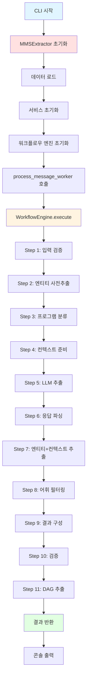
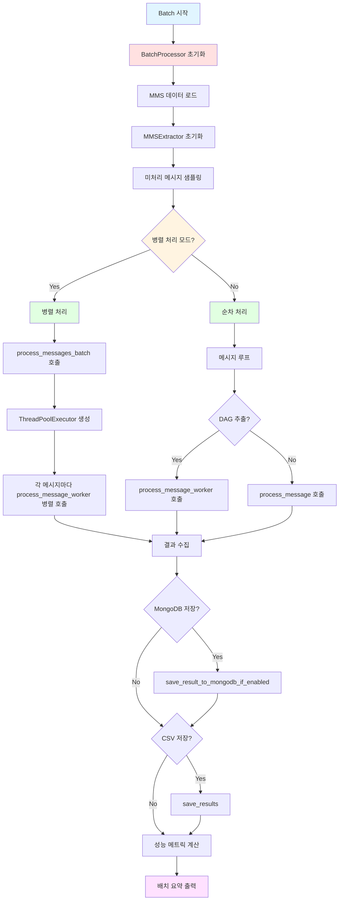

# MMS Extractor 실행 흐름 문서

이 문서는 MMS Extractor를 CLI 또는 API를 통해 실행할 때 호출되는 모든 클래스와 함수를 순서대로 정리합니다.

---

## 목차
1. [CLI 실행 흐름](#cli-실행-흐름)
2. [API 실행 흐름](#api-실행-흐름)
3. [Batch 실행 흐름](#batch-실행-흐름)
4. [공통 실행 흐름](#공통-실행-흐름)

---

# CLI 실행 흐름

## 명령어
```bash
python apps/cli.py --offer-data-source local --extract-entity-dag
```

## CLI 실행 흐름 개요

CLI 명령어 실행 시 호출되는 모든 클래스와 함수를 순서대로 정리합니다.

---

## 1단계: CLI 진입점

### 1.1 [`main()`](file:///Users/yongwook/workspace/AgenticWorkflow/mms_extractor_exp/apps/cli.py#L52)
- **파일**: [apps/cli.py](file:///Users/yongwook/workspace/AgenticWorkflow/mms_extractor_exp/apps/cli.py)
- **입력**: 없음 (커맨드라인 인자 파싱)
- **출력**: 없음 (결과를 콘솔에 출력)
- **주요 작업**:
  - 커맨드라인 인자 파싱 (`argparse`)
  - 로그 레벨 설정
  - `MMSExtractor` 인스턴스 생성
  - 메시지 처리 실행

---

## 2단계: MMSExtractor 초기화

### 2.1 [`MMSExtractor.__init__()`](file:///Users/yongwook/workspace/AgenticWorkflow/mms_extractor_exp/core/mms_extractor.py#L347)
- **파일**: [core/mms_extractor.py](file:///Users/yongwook/workspace/AgenticWorkflow/mms_extractor_exp/core/mms_extractor.py)
- **입력**: 
  - `offer_info_data_src` = 'local'
  - `extract_entity_dag` = True
  - 기타 설정 매개변수
- **출력**: `MMSExtractor` 인스턴스
- **주요 작업**:
  - 기본 설정 적용
  - 환경변수 로드
  - 디바이스, LLM, 임베딩 모델, Kiwi, 데이터 초기화
  - 서비스 및 워크플로우 엔진 초기화

#### 2.1.1 [`_set_default_config()`](file:///Users/yongwook/workspace/AgenticWorkflow/mms_extractor_exp/core/mms_extractor.py#L472)
- **입력**: `model_path`, `data_dir`, `product_info_extraction_mode`, `entity_extraction_mode`, `offer_info_data_src`, `llm_model`, `entity_llm_model`, `extract_entity_dag`, `entity_extraction_context_mode`
- **출력**: 없음 (인스턴스 속성 설정)
- **주요 작업**: 기본 설정값 적용

#### 2.1.2 [`_initialize_device()`](file:///Users/yongwook/workspace/AgenticWorkflow/mms_extractor_exp/core/mms_extractor.py#L496)
- **입력**: 없음
- **출력**: 없음 (`self.device` 설정)
- **주요 작업**: GPU/CPU 디바이스 선택

#### 2.1.3 [`_initialize_llm()`](file:///Users/yongwook/workspace/AgenticWorkflow/mms_extractor_exp/core/mms_extractor.py#L507)
- **입력**: 없음
- **출력**: 없음 (`self.llm_model` 설정)
- **주요 작업**: LLM 모델 초기화 (ChatOpenAI)

#### 2.1.4 [`_initialize_embedding_model()`](file:///Users/yongwook/workspace/AgenticWorkflow/mms_extractor_exp/core/mms_extractor.py#L546)
- **입력**: 없음
- **출력**: 없음 (`self.emb_model` 설정)
- **주요 작업**: SentenceTransformer 임베딩 모델 로드

#### 2.1.5 [`_initialize_kiwi()`](file:///Users/yongwook/workspace/AgenticWorkflow/mms_extractor_exp/core/mms_extractor.py#L583)
- **입력**: 없음
- **출력**: 없음 (`self.kiwi` 설정)
- **주요 작업**: Kiwi 형태소 분석기 초기화

#### 2.1.6 [`_load_data()`](file:///Users/yongwook/workspace/AgenticWorkflow/mms_extractor_exp/core/mms_extractor.py#L602)
- **입력**: 없음
- **출력**: 없음 (데이터 로드 및 인스턴스 속성 설정)
- **주요 작업**: 상품, 프로그램, 조직 데이터 로드

##### 2.1.6.1 [`_load_item_data()`](file:///Users/yongwook/workspace/AgenticWorkflow/mms_extractor_exp/core/mms_extractor.py#L663)
- **입력**: 없음
- **출력**: 없음 (`self.item_pdf_all`, `self.alias_pdf_raw` 설정)
- **주요 작업**: ItemDataLoader를 통한 상품 정보 로드

###### 2.1.6.1.1 [`ItemDataLoader.load_and_prepare_items()`](file:///Users/yongwook/workspace/AgenticWorkflow/mms_extractor_exp/services/item_data_loader.py#L529)
- **파일**: [services/item_data_loader.py](file:///Users/yongwook/workspace/AgenticWorkflow/mms_extractor_exp/services/item_data_loader.py)
- **입력**: `offer_data_path`, `alias_rules_path`, `output_path`, `data_source`
- **출력**: `(item_pdf_all, alias_pdf)` - 전처리된 상품 데이터와 별칭 규칙
- **주요 작업**: 상품 데이터 로드 및 전처리 파이프라인 실행
  1. [`load_raw_data()`](file:///Users/yongwook/workspace/AgenticWorkflow/mms_extractor_exp/services/item_data_loader.py#L169) - CSV에서 원시 데이터 로드
  2. [`normalize_columns()`](file:///Users/yongwook/workspace/AgenticWorkflow/mms_extractor_exp/services/item_data_loader.py#L216) - 컬럼명 정규화
  3. [`filter_by_domain()`](file:///Users/yongwook/workspace/AgenticWorkflow/mms_extractor_exp/services/item_data_loader.py#L247) - 도메인 필터링
  4. [`load_alias_rules()`](file:///Users/yongwook/workspace/AgenticWorkflow/mms_extractor_exp/services/item_data_loader.py#L269) - 별칭 규칙 로드
  5. [`expand_build_aliases()`](file:///Users/yongwook/workspace/AgenticWorkflow/mms_extractor_exp/services/item_data_loader.py#L297) - Build 타입 별칭 확장
  6. [`create_bidirectional_aliases()`](file:///Users/yongwook/workspace/AgenticWorkflow/mms_extractor_exp/services/item_data_loader.py#L334) - 양방향 별칭 추가
  7. [`apply_cascading_alias_rules()`](file:///Users/yongwook/workspace/AgenticWorkflow/mms_extractor_exp/services/item_data_loader.py#L353) - 별칭 규칙 연쇄 적용
  8. [`add_user_defined_entities()`](file:///Users/yongwook/workspace/AgenticWorkflow/mms_extractor_exp/services/item_data_loader.py#L460) - 사용자 정의 엔티티 추가
  9. [`add_domain_name_column()`](file:///Users/yongwook/workspace/AgenticWorkflow/mms_extractor_exp/services/item_data_loader.py#L486) - 도메인명 컬럼 추가
  10. [`filter_test_items()`](file:///Users/yongwook/workspace/AgenticWorkflow/mms_extractor_exp/services/item_data_loader.py#L511) - TEST 항목 필터링

##### 2.1.6.2 [`_load_stopwords()`](file:///Users/yongwook/workspace/AgenticWorkflow/mms_extractor_exp/core/mms_extractor.py#L700)
- **입력**: 없음
- **출력**: 없음 (`self.stop_item_names` 설정)
- **주요 작업**: 정지어 목록 로드

##### 2.1.6.3 [`_register_items_in_kiwi()`](file:///Users/yongwook/workspace/AgenticWorkflow/mms_extractor_exp/core/mms_extractor.py#L714)
- **입력**: 없음
- **출력**: 없음
- **주요 작업**: Kiwi에 상품명들을 고유명사로 등록

##### 2.1.6.4 [`_load_program_data()`](file:///Users/yongwook/workspace/AgenticWorkflow/mms_extractor_exp/core/mms_extractor.py#L753)
- **입력**: 없음
- **출력**: 없음 (`self.pgm_pdf`, `self.clue_embeddings` 설정)
- **주요 작업**: 프로그램 분류 정보 로드 및 임베딩 생성

##### 2.1.6.5 [`_load_organization_data()`](file:///Users/yongwook/workspace/AgenticWorkflow/mms_extractor_exp/core/mms_extractor.py#L796)
- **입력**: 없음
- **출력**: 없음 (`self.org_pdf` 설정)
- **주요 작업**: 조직/매장 정보 로드

#### 2.1.7 서비스 초기화

##### 2.1.7.1 `EntityRecognizer` 초기화
- **파일**: [services/entity_recognizer.py](file:///Users/yongwook/workspace/AgenticWorkflow/mms_extractor_exp/services/entity_recognizer.py)
- **입력**: `kiwi`, `item_pdf_all`, `stop_item_names`, `llm_model`, `alias_pdf_raw`, `entity_extraction_mode`
- **출력**: `EntityRecognizer` 인스턴스

##### 2.1.7.2 `ProgramClassifier` 초기화
- **파일**: [services/program_classifier.py](file:///Users/yongwook/workspace/AgenticWorkflow/mms_extractor_exp/services/program_classifier.py)
- **입력**: `emb_model`, `pgm_pdf`, `clue_embeddings`, `num_cand_pgms`
- **출력**: `ProgramClassifier` 인스턴스

##### 2.1.7.3 `StoreMatcher` 초기화
- **파일**: [services/store_matcher.py](file:///Users/yongwook/workspace/AgenticWorkflow/mms_extractor_exp/services/store_matcher.py)
- **입력**: `org_pdf`
- **출력**: `StoreMatcher` 인스턴스

##### 2.1.7.4 `ResultBuilder` 초기화
- **파일**: [services/result_builder.py](file:///Users/yongwook/workspace/AgenticWorkflow/mms_extractor_exp/services/result_builder.py)
- **입력**: `store_matcher`, `stop_item_names`, `num_cand_pgms`
- **출력**: `ResultBuilder` 인스턴스

#### 2.1.8 워크플로우 엔진 초기화

##### 2.1.8.1 `WorkflowEngine` 초기화
- **파일**: [core/workflow_core.py](file:///Users/yongwook/workspace/AgenticWorkflow/mms_extractor_exp/core/workflow_core.py)
- **입력**: `name` = "MMS Extraction Workflow"
- **출력**: `WorkflowEngine` 인스턴스
- **주요 작업**: 11개 워크플로우 단계 등록 (각 단계는 `should_execute()`로 조건부 스킵 가능)
  1. `InputValidationStep`
  2. `EntityExtractionStep` (`--skip-entity-extraction` 시 스킵)
  3. `ProgramClassificationStep`
  4. `ContextPreparationStep`
  5. `LLMExtractionStep`
  6. `ResponseParsingStep`
  7. `EntityContextExtractionStep` (logic 모드 시 스킵)
  8. `VocabularyFilteringStep`
  9. `ResultConstructionStep`
  10. `ValidationStep`
  11. `DAGExtractionStep` (extract_entity_dag=True일 때만)

---

## 3단계: 메시지 처리

### 3.1 [`process_message_worker()`](file:///Users/yongwook/workspace/AgenticWorkflow/mms_extractor_exp/core/mms_extractor.py#L1170)
- **파일**: [core/mms_extractor.py](file:///Users/yongwook/workspace/AgenticWorkflow/mms_extractor_exp/core/mms_extractor.py)
- **입력**: `extractor`, `message`, `extract_dag`, `message_id`
- **출력**: `result` - 처리 결과 딕셔너리
- **주요 작업**:
  - 프롬프트 저장소 초기화
  - `extractor.process_message()` 호출
  - DAG 추출 (필요 시)

#### 3.1.1 [`MMSExtractor.process_message()`](file:///Users/yongwook/workspace/AgenticWorkflow/mms_extractor_exp/core/mms_extractor.py#L968)
- **입력**: `message`, `message_id`
- **출력**: `result` - 처리 결과 딕셔너리
- **주요 작업**: 워크플로우 엔진을 통한 11단계 처리 실행

##### 3.1.1.1 워크플로우 실행: [`WorkflowEngine.execute()`](file:///Users/yongwook/workspace/AgenticWorkflow/mms_extractor_exp/core/workflow_core.py)
- **파일**: [core/workflow_core.py](file:///Users/yongwook/workspace/AgenticWorkflow/mms_extractor_exp/core/workflow_core.py)
- **입력**: `initial_state` - WorkflowState 객체
- **출력**: `final_state` - 처리 완료된 WorkflowState 객체
- **주요 작업**: 등록된 모든 단계를 순차적으로 실행

---

## 4단계: 워크플로우 단계별 실행

### Step 1: [`InputValidationStep.execute()`](file:///Users/yongwook/workspace/AgenticWorkflow/mms_extractor_exp/core/mms_workflow_steps.py#L206)
- **파일**: [core/mms_workflow_steps.py](file:///Users/yongwook/workspace/AgenticWorkflow/mms_extractor_exp/core/mms_workflow_steps.py)
- **입력**: `state` (WorkflowState)
- **출력**: 없음 (state 업데이트)
- **주요 작업**:
  - 메시지 유효성 검증
  - 메시지 정보 로깅
  - 추출기 설정 로깅

### Step 2: [`EntityExtractionStep.execute()`](file:///Users/yongwook/workspace/AgenticWorkflow/mms_extractor_exp/core/mms_workflow_steps.py#L266)
- **입력**: `state`
- **출력**: 없음 (state에 `entities_from_kiwi`, `cand_item_list`, `extra_item_pdf` 추가)
- **주요 작업**:
  - Kiwi 형태소 분석을 통한 NNP 태그 추출
  - 임베딩 기반 유사도 매칭
  - 후보 상품 목록 생성

#### 2.1 [`EntityRecognizer.extract_entities_hybrid()`](file:///Users/yongwook/workspace/AgenticWorkflow/mms_extractor_exp/services/entity_recognizer.py#L247)
- **파일**: [services/entity_recognizer.py](file:///Users/yongwook/workspace/AgenticWorkflow/mms_extractor_exp/services/entity_recognizer.py)
- **입력**: `mms_msg` (str)
- **출력**: `(entities_from_kiwi, cand_item_list, extra_item_pdf)` - Tuple[List[str], List[str], pd.DataFrame]
- **주요 작업**: 하이브리드 엔티티 추출 (Kiwi 형태소 분석 + Fuzzy Matching + Sequence Similarity)

### Step 3: [`ProgramClassificationStep.execute()`](file:///Users/yongwook/workspace/AgenticWorkflow/mms_extractor_exp/core/mms_workflow_steps.py#L347)
- **입력**: `state`
- **출력**: 없음 (state에 `pgm_info` 추가)
- **주요 작업**: 프로그램 카테고리 분류

#### 3.1 [`ProgramClassifier.classify()`](file:///Users/yongwook/workspace/AgenticWorkflow/mms_extractor_exp/services/program_classifier.py)
- **파일**: [services/program_classifier.py](file:///Users/yongwook/workspace/AgenticWorkflow/mms_extractor_exp/services/program_classifier.py)
- **입력**: `msg`
- **출력**: `pgm_info` - 프로그램 분류 정보 딕셔너리
- **주요 작업**: 임베딩 기반 프로그램 유사도 계산 및 상위 N개 선택

### Step 4: [`ContextPreparationStep.execute()`](file:///Users/yongwook/workspace/AgenticWorkflow/mms_extractor_exp/core/mms_workflow_steps.py#L382)
- **입력**: `state`
- **출력**: 없음 (state에 `rag_context`, `product_element` 추가)
- **주요 작업**:
  - RAG 컨텍스트 준비
  - 제품 정보 요소 생성
  - 프롬프트 구성 요소 준비

### Step 5: [`LLMExtractionStep.execute()`](file:///Users/yongwook/workspace/AgenticWorkflow/mms_extractor_exp/core/mms_workflow_steps.py#L488)
- **입력**: `state`
- **출력**: 없음 (state에 `llm_response` 추가)
- **주요 작업**:
  - LLM 프롬프트 구성
  - LLM API 호출
  - 응답 수신

#### 5.1 [`build_extraction_prompt()`](file:///Users/yongwook/workspace/AgenticWorkflow/mms_extractor_exp/prompts/__init__.py)
- **파일**: [prompts/\_\_init\_\_.py](file:///Users/yongwook/workspace/AgenticWorkflow/mms_extractor_exp/prompts/__init__.py)
- **입력**: `msg`, `rag_context`, `product_element`
- **출력**: `prompt` - 구성된 프롬프트 문자열
- **주요 작업**: LLM 추출용 프롬프트 생성

### Step 6: [`ResponseParsingStep.execute()`](file:///Users/yongwook/workspace/AgenticWorkflow/mms_extractor_exp/core/mms_workflow_steps.py#L538)
- **입력**: `state`
- **출력**: 없음 (state에 `parsed_response` 추가)
- **주요 작업**:
  - LLM 응답 파싱
  - JSON 객체 추출
  - 스키마 검증

#### 6.1 [`extract_json_objects()`](file:///Users/yongwook/workspace/AgenticWorkflow/mms_extractor_exp/utils/__init__.py)
- **파일**: [utils/\_\_init\_\_.py](file:///Users/yongwook/workspace/AgenticWorkflow/mms_extractor_exp/utils/__init__.py)
- **입력**: `llm_response`
- **출력**: `parsed_json` - 파싱된 JSON 객체
- **주요 작업**: LLM 응답에서 JSON 추출 및 파싱

### Step 7: [`EntityContextExtractionStep.execute()`](file:///Users/yongwook/workspace/AgenticWorkflow/mms_extractor_exp/core/mms_workflow_steps.py)
- **입력**: `state`, `extraction_engine`, `entity_extraction_mode`
- **출력**: `state.extracted_entities` (dict with keys: entities, context_text, entity_types, relationships)
- **조건부 스킵**: `should_execute()` → `has_error` 또는 `entity_extraction_mode='logic'`이면 스킵
- **주요 작업 (Stage 1: 엔티티 및 컨텍스트 추출)**:
  - **LangExtract 엔진** (`extraction_engine='langextract'`):
    - [`extract_mms_entities(msg, model_id)`](file:///Users/yongwook/workspace/AgenticWorkflow/mms_extractor_exp/core/lx_extractor.py) 호출
    - 6-type 엔티티 추출: Product, Store, Program, Channel, Purpose, Other
    - 결과: `{'entities': [...], 'context_text': "...", 'entity_types': {}, 'relationships': []}`
  - **Default 엔진** (`extraction_engine='default'`):
    - [`entity_recognizer._extract_entities_stage1(msg, context_mode, llm_models)`](file:///Users/yongwook/workspace/AgenticWorkflow/mms_extractor_exp/services/entity_recognizer.py) 호출
    - DAG/ONT/TYPED 프롬프트 기반 LLM 엔티티 추출
    - 결과: `{'entities': [...], 'context_text': "...", 'entity_types': {...}, 'relationships': [...]}`

#### 7.1 [`extract_mms_entities()`](file:///Users/yongwook/workspace/AgenticWorkflow/mms_extractor_exp/core/lx_extractor.py) (LangExtract)
- **파일**: [core/lx_extractor.py](file:///Users/yongwook/workspace/AgenticWorkflow/mms_extractor_exp/core/lx_extractor.py)
- **입력**: `msg`, `model_id`
- **출력**: `ExtractionDocument` (entities with types)
- **주요 작업**: Google langextract 기반 6-type 엔티티 추출

#### 7.2 [`_extract_entities_stage1()`](file:///Users/yongwook/workspace/AgenticWorkflow/mms_extractor_exp/services/entity_recognizer.py) (Default)
- **파일**: [services/entity_recognizer.py](file:///Users/yongwook/workspace/AgenticWorkflow/mms_extractor_exp/services/entity_recognizer.py)
- **입력**: `msg`, `context_mode`, `llm_models`, `external_cand_entities`
- **출력**: dict with entities, context_text, entity_types, relationships
- **주요 작업**: DAG/ONT/TYPED 프롬프트 기반 LLM 엔티티 추출

### Step 8: [`VocabularyFilteringStep.execute()`](file:///Users/yongwook/workspace/AgenticWorkflow/mms_extractor_exp/core/mms_workflow_steps.py)
- **입력**: `state`, `entity_extraction_mode`
- **출력**: `state.matched_products` (매칭된 상품 리스트)
- **주요 작업 (Stage 2: 어휘 매칭 및 필터링)**:
  - **Logic 모드** (`entity_extraction_mode='logic'`):
    - Kiwi 추출 엔티티 + LLM 파싱 상품으로 후보 구성
    - `entity_recognizer.extract_entities_with_fuzzy_matching(cand_entities)` 호출
    - Fuzzy/sequence 유사도 기반 매칭
  - **LLM 모드** (`entity_extraction_mode='llm'`):
    - Step 7의 extracted_entities 사용
    - `entity_recognizer._filter_entities_stage2(msg, extracted_entities, context_mode)` 호출
    - LLM 기반 vocabulary 필터링
  - alias type 필터링 (non-expansion 타입 제거)
  - `entity_recognizer.map_products_to_entities(similarities, json_objects)` 호출
  - 결과를 `state.matched_products`에 저장

### Step 9: [`ResultConstructionStep.execute()`](file:///Users/yongwook/workspace/AgenticWorkflow/mms_extractor_exp/core/mms_workflow_steps.py)
- **입력**: `state`
- **출력**: 없음 (state에 `final_result` 추가)
- **주요 작업**:
  - `state.matched_products`에서 매칭된 상품 읽기
  - ResultBuilder.assemble_result() 호출로 최종 결과 조립
  - 채널 정보 추출, 프로그램 매핑, Offer 객체 생성

#### 9.1 [`ResultBuilder.assemble_result()`](file:///Users/yongwook/workspace/AgenticWorkflow/mms_extractor_exp/services/result_builder.py)
- **파일**: [services/result_builder.py](file:///Users/yongwook/workspace/AgenticWorkflow/mms_extractor_exp/services/result_builder.py)
- **입력**: `json_objects`, `matched_products`, `msg`, `pgm_info`, `message_id`
- **출력**: `final_result` - 최종 결과 딕셔너리
- **주요 작업**:
  - 채널 추출 및 보강
  - 프로그램 매핑
  - Offer 객체 생성
  - entity_dag, message_id 첨부

### Step 10: [`ValidationStep.execute()`](file:///Users/yongwook/workspace/AgenticWorkflow/mms_extractor_exp/core/mms_workflow_steps.py)
- **입력**: `state`
- **출력**: 없음 (state 검증)
- **주요 작업**:
  - 결과 유효성 검증
  - 최종 결과 요약 로깅

#### 10.1 [`validate_extraction_result()`](file:///Users/yongwook/workspace/AgenticWorkflow/mms_extractor_exp/utils/__init__.py)
- **파일**: [utils/\_\_init\_\_.py](file:///Users/yongwook/workspace/AgenticWorkflow/mms_extractor_exp/utils/__init__.py)
- **입력**: `final_result`
- **출력**: `is_valid` - 검증 결과 (bool)
- **주요 작업**: 결과 스키마 및 데이터 유효성 검증

### Step 11: [`DAGExtractionStep.execute()`](file:///Users/yongwook/workspace/AgenticWorkflow/mms_extractor_exp/core/mms_workflow_steps.py)
- **입력**: `state`
- **출력**: 없음 (state의 `final_result`에 `entity_dag` 추가)
- **주요 작업**:
  - 엔티티 간 관계 그래프 생성
  - DAG 다이어그램 생성

#### 10.1 [`make_entity_dag()`](file:///Users/yongwook/workspace/AgenticWorkflow/mms_extractor_exp/core/entity_dag_extractor.py)
- **파일**: [core/entity_dag_extractor.py](file:///Users/yongwook/workspace/AgenticWorkflow/mms_extractor_exp/core/entity_dag_extractor.py)
- **입력**: `msg`, `llm_model`, `message_id`
- **출력**: `dag_result` - DAG 정보 딕셔너리
- **주요 작업**: LLM을 통한 엔티티 관계 추출 및 DAG 생성

---

## 5단계: 결과 반환 및 출력

### 5.1 결과 구조

최종 반환되는 `result` 딕셔너리는 다음 구조를 가집니다:

```python
{
    "ext_result": {
        "message_id": str,
        "title": str,
        "purpose": List[str],
        "sales_script": str,
        "product": List[Dict],
        "channel": List[Dict],
        "pgm": List[Dict],
        "offer": {
            "type": str,
            "value": List[Dict]
        },
        "entity_dag": List[str]  # DAG 추출 시
    },
    "raw_result": {
        "message_id": str,
        # ... 원시 추출 결과
    },
    "prompts": {
        # ... 사용된 프롬프트들
    },
    "error": str
}
```

### 5.2 콘솔 출력

[`main()`](file:///Users/yongwook/workspace/AgenticWorkflow/mms_extractor_exp/apps/cli.py#L52) 함수에서 결과를 JSON 형식으로 콘솔에 출력합니다.

---

## 주요 데이터 흐름



---

## 핵심 서비스 역할

| 서비스 | 파일 | 주요 역할 |
|--------|------|-----------|
| **ItemDataLoader** | [services/item_data_loader.py](file:///Users/yongwook/workspace/AgenticWorkflow/mms_extractor_exp/services/item_data_loader.py) | 상품 데이터 로드 및 전처리 (별칭 규칙 적용) |
| **EntityRecognizer** | [services/entity_recognizer.py](file:///Users/yongwook/workspace/AgenticWorkflow/mms_extractor_exp/services/entity_recognizer.py) | Kiwi + 임베딩 기반 엔티티 추출 |
| **ProgramClassifier** | [services/program_classifier.py](file:///Users/yongwook/workspace/AgenticWorkflow/mms_extractor_exp/services/program_classifier.py) | 임베딩 기반 프로그램 분류 |
| **StoreMatcher** | [services/store_matcher.py](file:///Users/yongwook/workspace/AgenticWorkflow/mms_extractor_exp/services/store_matcher.py) | 매장 정보 매칭 |
| **ResultBuilder** | [services/result_builder.py](file:///Users/yongwook/workspace/AgenticWorkflow/mms_extractor_exp/services/result_builder.py) | 결과 조립 (채널, 프로그램 매핑, Offer 생성) |

---

# API 실행 흐름

## API 요청 예시
```python
import requests

response = requests.post('http://127.0.0.1:8000/extract', json={
    "message": "(광고)[SKT] 9월 T day 혜택 안내...",
    "message_id": "test_message_id",
    "llm_model": "ax",
    "product_info_extraction_mode": "llm",
    "entity_matching_mode": "llm",
    "extract_entity_dag": True,
    "result_type": "ext",
    "save_to_mongodb": True
})
```

## API 실행 흐름 개요

REST API를 통한 메시지 처리 시 호출되는 모든 클래스와 함수를 순서대로 정리합니다.

---

## API 1단계: 서버 시작 및 초기화

### API 1.1 서버 시작
- **파일**: [apps/api.py](file:///Users/yongwook/workspace/AgenticWorkflow/mms_extractor_exp/apps/api.py)
- **진입점**: `if __name__ == '__main__'` 블록
- **주요 작업**:
  - Flask 앱 초기화
  - CORS 설정
  - 로깅 설정
  - 전역 추출기 초기화

### API 1.2 [`initialize_global_extractor()`](file:///Users/yongwook/workspace/AgenticWorkflow/mms_extractor_exp/apps/api.py#L286)
- **입력**: `offer_info_data_src` = 'db' (기본값)
- **출력**: `global_extractor` - MMSExtractor 인스턴스
- **주요 작업**:
  - 전역 `MMSExtractor` 인스턴스 생성 (서버 시작 시 1회만)
  - **이 단계에서 [2단계: MMSExtractor 초기화](#2단계-mmsextractor-초기화)의 모든 하위 단계가 실행됨**
  - 데이터 로딩 및 모델 초기화 완료

---

## API 2단계: API 요청 처리

### API 2.1 [`extract_message()`](file:///Users/yongwook/workspace/AgenticWorkflow/mms_extractor_exp/apps/api.py#L472)
- **파일**: [apps/api.py](file:///Users/yongwook/workspace/AgenticWorkflow/mms_extractor_exp/apps/api.py)
- **엔드포인트**: `POST /extract`
- **입력**: JSON 요청 바디
  - `message` (필수)
  - `message_id` (선택, 기본값: '#')
  - `llm_model` (선택, 기본값: 'ax')
  - `product_info_extraction_mode` (선택)
  - `entity_matching_mode` (선택)
  - `extract_entity_dag` (선택, 기본값: True)
  - `save_to_mongodb` (선택, 기본값: True)
  - `result_type` (선택, 기본값: 'ext')
- **출력**: JSON 응답
- **주요 작업**:
  - 요청 데이터 검증
  - 파라미터 추출 및 유효성 검증
  - 전역 추출기 구성
  - 메시지 처리 실행

### API 2.2 [`get_configured_extractor()`](file:///Users/yongwook/workspace/AgenticWorkflow/mms_extractor_exp/apps/api.py#L368)
- **입력**: `llm_model`, `product_info_extraction_mode`, `entity_matching_mode`, `entity_llm_model`, `extract_entity_dag`, `entity_extraction_context_mode`
- **출력**: `global_extractor` - 구성된 추출기 인스턴스
- **주요 작업**:
  - 전역 추출기의 런타임 설정 업데이트 (데이터 재로딩 없이)
  - LLM 모델 변경 시 재초기화
  - 각 API 요청마다 다른 설정 사용 가능

---

## API 3단계: 메시지 처리 (CLI와 동일)

### API 3.1 메시지 처리 호출
- **파일**: [apps/api.py](file:///Users/yongwook/workspace/AgenticWorkflow/mms_extractor_exp/apps/api.py)
- **주요 작업**:
  - `extract_entity_dag=True`인 경우: [`process_message_worker()`](file:///Users/yongwook/workspace/AgenticWorkflow/mms_extractor_exp/core/mms_extractor.py#L1170) 호출
  - `extract_entity_dag=False`인 경우: [`extractor.process_message()`](file:///Users/yongwook/workspace/AgenticWorkflow/mms_extractor_exp/core/mms_extractor.py) 호출

> **💡 중요**: 이 시점부터 [3단계: 메시지 처리](#3단계-메시지-처리) 및 [4단계: 워크플로우 단계별 실행](#4단계-워크플로우-단계별-실행)과 **완전히 동일한 흐름**을 따릅니다.

---

## API 4단계: MongoDB 저장 (선택적)

### API 4.1 [`save_result_to_mongodb_if_enabled()`](file:///Users/yongwook/workspace/AgenticWorkflow/mms_extractor_exp/core/mms_extractor.py)
- **파일**: [core/mms_extractor.py](file:///Users/yongwook/workspace/AgenticWorkflow/mms_extractor_exp/core/mms_extractor.py)
- **입력**: `message`, `result`, `data`, `extractor`
- **출력**: `saved_id` - MongoDB 문서 ID (또는 None)
- **주요 작업**:
  - `save_to_mongodb=True`인 경우 결과를 MongoDB에 저장
  - 메시지, 추출 결과, 메타데이터 저장

---

## API 5단계: 응답 반환

### API 5.1 JSON 응답 구성
- **파일**: [apps/api.py](file:///Users/yongwook/workspace/AgenticWorkflow/mms_extractor_exp/apps/api.py)
- **응답 구조**:
```python
{
    "success": True,
    "result": {
        # ext_result 또는 raw_result (result_type에 따라)
        "message_id": str,
        "title": str,
        "purpose": List[str],
        "sales_script": str,
        "product": List[Dict],
        "channel": List[Dict],
        "pgm": List[Dict],
        "offer": {"type": str, "value": List[Dict]},
        "entity_dag": List[str]  # extract_entity_dag=True인 경우
    },
    "metadata": {
        "llm_model": str,
        "offer_info_data_src": str,
        "product_info_extraction_mode": str,
        "entity_matching_mode": str,
        "extract_entity_dag": bool,
        "processing_time_seconds": float,
        "timestamp": float,
        "message_length": int
    },
    "prompts": {
        "success": True,
        "prompts": Dict,  # 캡처된 프롬프트들
        "settings": Dict,
        "message_info": Dict,
        "timestamp": float
    }
}
```

---

## API vs CLI 비교

| 항목 | CLI | API |
|------|-----|-----|
| **진입점** | [`main()`](file:///Users/yongwook/workspace/AgenticWorkflow/mms_extractor_exp/apps/cli.py#L52) | [`extract_message()`](file:///Users/yongwook/workspace/AgenticWorkflow/mms_extractor_exp/apps/api.py#L472-L660) |
| **추출기 초기화** | 매 실행마다 새로 생성 | 서버 시작 시 1회만 (전역 인스턴스) |
| **설정 변경** | 커맨드라인 인자 | JSON 요청 파라미터 |
| **결과 출력** | 콘솔 (stdout) | JSON HTTP 응답 |
| **MongoDB 저장** | `--save-to-mongodb` 플래그 | `save_to_mongodb` JSON 파라미터 |
| **배치 처리** | `--batch-file` 옵션 | `POST /extract/batch` 엔드포인트 |
| **성능** | 초기화 오버헤드 있음 | 전역 추출기 재사용으로 빠름 |
| **메시지 처리** | **동일** ([3단계](#3단계-메시지-처리) 이후) | **동일** ([3단계](#3단계-메시지-처리) 이후) |

---

# Batch 실행 흐름

## 명령어
```bash
python apps/batch.py --offer-data-source local --batch-size 3
```

## Batch 실행 흐름 개요

배치 처리 명령어 실행 시 호출되는 모든 클래스와 함수를 순서대로 정리합니다. 배치 처리는 여러 메시지를 병렬 또는 순차적으로 처리하며, MongoDB 저장 및 CSV 결과 저장을 지원합니다.

---

## Batch 1단계: 배치 진입점

### Batch 1.1 [`main()`](file:///Users/yongwook/workspace/AgenticWorkflow/mms_extractor_exp/apps/batch.py#L680)
- **파일**: [apps/batch.py](file:///Users/yongwook/workspace/AgenticWorkflow/mms_extractor_exp/apps/batch.py)
- **입력**: 없음 (커맨드라인 인자 파싱)
- **출력**: `summary` - 배치 처리 결과 요약 딕셔너리
- **주요 작업**:
  - 커맨드라인 인자 파싱 (`argparse`)
  - 로그 레벨 설정
  - MongoDB 연결 테스트 (옵션)
  - `BatchProcessor` 인스턴스 생성
  - 배치 처리 실행

---

## Batch 2단계: BatchProcessor 초기화

### Batch 2.1 [`BatchProcessor.__init__()`](file:///Users/yongwook/workspace/AgenticWorkflow/mms_extractor_exp/apps/batch.py#L100)
- **파일**: [apps/batch.py](file:///Users/yongwook/workspace/AgenticWorkflow/mms_extractor_exp/apps/batch.py)
- **입력**:
  - `result_file_path` = './results/batch_results.csv'
  - `max_workers` = CPU 코어 수 (기본값)
  - `enable_multiprocessing` = True (기본값)
  - `save_to_mongodb` = True (기본값)
  - `save_results_enabled` = False (기본값)
- **출력**: `BatchProcessor` 인스턴스
- **주요 작업**:
  - 배치 처리 설정 초기화
  - 워커 수 설정
  - 병렬/순차 처리 모드 설정

---

## Batch 3단계: 배치 처리 실행

### Batch 3.1 [`BatchProcessor.run_batch()`](file:///Users/yongwook/workspace/AgenticWorkflow/mms_extractor_exp/apps/batch.py#L582)
- **입력**: `batch_size`, `**extractor_kwargs`
- **출력**: `summary` - 처리 결과 요약 딕셔너리
- **주요 작업**:
  - MMS 데이터 로드
  - MMSExtractor 초기화
  - 미처리 메시지 샘플링
  - 메시지 처리 (병렬 또는 순차)
  - 결과 저장 (옵션)
  - 성능 메트릭 계산

#### Batch 3.1.1 [`BatchProcessor.load_mms_data()`](file:///Users/yongwook/workspace/AgenticWorkflow/mms_extractor_exp/apps/batch.py#L136)
- **입력**: 없음
- **출력**: 없음 (`self.mms_pdf` 설정)
- **주요 작업**:
  - CSV 파일에서 MMS 메시지 로드
  - 컬럼명 정규화 (`mms_phrs` → `msg`)
  - 빈 메시지 필터링
  - `msg_id` 컬럼 추가

#### Batch 3.1.2 [`BatchProcessor.initialize_extractor()`](file:///Users/yongwook/workspace/AgenticWorkflow/mms_extractor_exp/apps/batch.py#L120)
- **입력**: `**extractor_kwargs`
- **출력**: 없음 (`self.extractor` 설정)
- **주요 작업**:
  - `MMSExtractor` 인스턴스 생성
  - **이 단계에서 [2단계: MMSExtractor 초기화](#2단계-mmsextractor-초기화)의 모든 하위 단계가 실행됨**
  - DAG 추출 모드 설정

#### Batch 3.1.3 [`BatchProcessor.sample_unprocessed_messages()`](file:///Users/yongwook/workspace/AgenticWorkflow/mms_extractor_exp/apps/batch.py#L197)
- **입력**: `batch_size`
- **출력**: `sampled_messages` - 샘플링된 메시지 DataFrame
- **주요 작업**:
  - 이전 처리 결과 파일에서 처리된 메시지 ID 로드
  - 미처리 메시지 필터링
  - 랜덤 샘플링

##### Batch 3.1.3.1 [`BatchProcessor.get_processed_msg_ids()`](file:///Users/yongwook/workspace/AgenticWorkflow/mms_extractor_exp/apps/batch.py#L173)
- **입력**: 없음
- **출력**: `processed_ids` - 처리된 메시지 ID 집합
- **주요 작업**: 결과 CSV 파일에서 처리된 메시지 ID 추출

---

## Batch 4단계: 메시지 처리 (병렬 또는 순차)

### Batch 4.1 [`BatchProcessor.process_messages()`](file:///Users/yongwook/workspace/AgenticWorkflow/mms_extractor_exp/apps/batch.py#L227)
- **입력**: `sampled_messages`
- **출력**: `results` - 처리 결과 리스트
- **주요 작업**:
  - 메시지 리스트 변환
  - 병렬/순차 처리 모드 선택
  - 처리 실행

### Batch 4.2 병렬 처리 모드

#### Batch 4.2.1 [`BatchProcessor._process_messages_parallel()`](file:///Users/yongwook/workspace/AgenticWorkflow/mms_extractor_exp/apps/batch.py#L272)
- **입력**: `messages_list`, `processing_time`
- **출력**: `results` - 처리 결과 리스트
- **주요 작업**:
  - `process_messages_batch()` 함수 호출
  - 병렬 처리 실행 (ThreadPoolExecutor)
  - MongoDB 저장 (옵션)
  - DAG 추출 결과 검증

##### Batch 4.2.1.1 [`process_messages_batch()`](file:///Users/yongwook/workspace/AgenticWorkflow/mms_extractor_exp/core/mms_extractor.py#L1280)
- **파일**: [core/mms_extractor.py](file:///Users/yongwook/workspace/AgenticWorkflow/mms_extractor_exp/core/mms_extractor.py)
- **입력**: `extractor`, `messages_list`, `extract_dag`, `max_workers`
- **출력**: `results` - 배치 처리 결과 리스트
- **주요 작업**:
  - ThreadPoolExecutor를 사용한 병렬 처리
  - 각 메시지마다 `process_message_worker()` 호출
  - 에러 처리 및 결과 수집

### Batch 4.3 순차 처리 모드

#### Batch 4.3.1 [`BatchProcessor._process_messages_sequential()`](file:///Users/yongwook/workspace/AgenticWorkflow/mms_extractor_exp/apps/batch.py#L388)
- **입력**: `messages_list`, `processing_time`
- **출력**: `results` - 처리 결과 리스트
- **주요 작업**:
  - 메시지를 하나씩 순차 처리
  - DAG 추출 시 `process_message_worker()` 호출
  - 일반 처리 시 `extractor.process_message()` 호출
  - MongoDB 저장 (옵션)
  - 에러 처리

> **💡 중요**: 병렬/순차 처리 모두 각 메시지 처리 시 [3단계: 메시지 처리](#3단계-메시지-처리) 및 [4단계: 워크플로우 단계별 실행](#4단계-워크플로우-단계별-실행)과 **완전히 동일한 흐름**을 따릅니다.

---

## Batch 5단계: 결과 저장 및 요약

### Batch 5.1 [`BatchProcessor.save_results()`](file:///Users/yongwook/workspace/AgenticWorkflow/mms_extractor_exp/apps/batch.py#L494)
- **입력**: `results`
- **출력**: `result_file_path` - 저장된 결과 파일 경로
- **주요 작업**:
  - 결과를 DataFrame으로 변환
  - 기존 결과 파일에 추가 (append) 또는 새 파일 생성
  - CSV 파일로 저장

### Batch 5.2 [`BatchProcessor.log_processing_summary()`](file:///Users/yongwook/workspace/AgenticWorkflow/mms_extractor_exp/apps/batch.py#L569)
- **입력**: `processed_msg_ids`
- **출력**: 없음
- **주요 작업**:
  - 처리 성공/실패 통계 로깅
  - 처리된 메시지 ID 로깅

### Batch 5.3 성능 메트릭 계산
- **메트릭**:
  - 총 처리 시간
  - 메시지당 평균 처리 시간
  - 처리량 (메시지/초)
  - 성공률 (%)

---

## Batch 배치 처리 흐름도



---

## Batch 처리 모드 비교

| 항목 | 병렬 처리 | 순차 처리 |
|------|----------|----------|
| **활성화 조건** | `--disable-multiprocessing` 없음 | `--disable-multiprocessing` 플래그 |
| **워커 수** | `--max-workers` 또는 CPU 코어 수 | 1 (단일 스레드) |
| **처리 함수** | `process_messages_batch()` | 메시지별 개별 호출 |
| **실행 방식** | ThreadPoolExecutor | for 루프 |
| **성능** | 빠름 (병렬 실행) | 느림 (순차 실행) |
| **에러 처리** | 개별 메시지 에러 격리 | 즉시 에러 처리 |
| **적합한 경우** | 대량 메시지 처리 | 디버깅, 소량 메시지 |

---

## Batch 주요 설정 옵션

### 배치 처리 옵션
- `--batch-size`: 처리할 메시지 수 (기본값: 10)
- `--output-file`: 결과 CSV 파일 경로 (기본값: ./results/batch_results.csv)
- `--save-results`: CSV 파일 저장 활성화 (기본값: False)

### 병렬 처리 옵션
- `--max-workers`: 최대 워커 수 (기본값: CPU 코어 수)
- `--disable-multiprocessing`: 병렬 처리 비활성화

### MMSExtractor 옵션
- `--offer-data-source`: 데이터 소스 (local/db, 기본값: db)
- `--product-info-extraction-mode`: 제품 정보 추출 모드 (기본값: llm)
- `--entity-extraction-mode`: 엔티티 추출 모드 (기본값: llm)
- `--llm-model`: 메인 LLM 모델 (기본값: ax)
- `--entity-llm-model`: 엔티티 추출 LLM 모델 (기본값: ax)
- `--extract-entity-dag`: DAG 추출 활성화 (기본값: False)
- `--entity-extraction-context-mode`: 엔티티 컨텍스트 모드 (기본값: dag)
- `--skip-entity-extraction`: Kiwi + fuzzy matching 기반 엔티티 사전추출 스킵 (Step 2)

### 저장 옵션
- `--save-to-mongodb`: MongoDB 저장 활성화 (기본값: True)
- `--log-level`: 로그 레벨 (DEBUG/INFO/WARNING/ERROR, 기본값: INFO)

---

## Batch 결과 구조

배치 처리 결과는 다음 구조를 가집니다:

```python
{
    'status': 'completed',
    'processed_count': int,           # 총 처리 메시지 수
    'successful_count': int,          # 성공한 메시지 수
    'failed_count': int,              # 실패한 메시지 수
    'results_file': str,              # 결과 파일 경로
    'processing_mode': str,           # '병렬 처리' 또는 '순차 처리'
    'max_workers': int,               # 사용된 워커 수
    'dag_extraction': bool,           # DAG 추출 여부
    'total_time_seconds': float,      # 총 처리 시간
    'processing_time_seconds': float, # 메시지 처리 시간
    'avg_time_per_message': float,    # 메시지당 평균 시간
    'throughput_messages_per_second': float,  # 처리량
    'success_rate': float             # 성공률 (%)
}
```

### CSV 결과 파일 구조

```csv
message_id,message,extraction_result,processed_at,title,purpose,product_count,channel_count,pgm
msg_001,"(광고)[SKT] ...","{...}","2025-12-18 14:00:00","T day 혜택","[\"프로모션\"]",3,2,"[...]"
```

---

## Batch vs CLI vs API 비교

| 항목 | Batch | CLI | API |
|------|-------|-----|-----|
| **진입점** | [`main()`](file:///Users/yongwook/workspace/AgenticWorkflow/mms_extractor_exp/apps/batch.py#L680) | [`main()`](file:///Users/yongwook/workspace/AgenticWorkflow/mms_extractor_exp/apps/cli.py#L52) | [`extract_message()`](file:///Users/yongwook/workspace/AgenticWorkflow/mms_extractor_exp/apps/api.py#L472) |
| **처리 방식** | 다중 메시지 (병렬/순차) | 단일 메시지 | 단일 메시지 (요청당) |
| **추출기 초기화** | 배치 실행마다 1회 | 매 실행마다 | 서버 시작 시 1회 |
| **병렬 처리** | 지원 (ThreadPoolExecutor) | 미지원 | 미지원 (요청별 처리) |
| **결과 저장** | CSV + MongoDB (옵션) | 콘솔 출력 | JSON 응답 + MongoDB (옵션) |
| **성능 메트릭** | 상세 (처리량, 평균 시간 등) | 없음 | 처리 시간만 |
| **적합한 용도** | 대량 메시지 일괄 처리 | 개별 메시지 테스트 | 실시간 서비스 |
| **메시지 처리** | **동일** ([3단계](#3단계-메시지-처리) 이후) | **동일** ([3단계](#3단계-메시지-처리) 이후) | **동일** ([3단계](#3단계-메시지-처리) 이후) |

---

# 공통 실행 흐름

> **📌 참고**: CLI와 API 모두 메시지 처리 단계부터는 **완전히 동일한 흐름**을 따릅니다.  
> 아래 섹션들은 CLI의 [3단계](#3단계-메시지-처리) 및 [4단계](#4단계-워크플로우-단계별-실행)와 동일하며,  
> API의 경우 [API 3단계](#api-3단계-메시지-처리-cli와-동일) 이후 동일한 흐름을 따릅니다.

---

## 참고사항

- **DAG 추출**: `--extract-entity-dag` 플래그가 활성화되면 Step 11 (DAGExtractionStep)이 실행됩니다. 모든 context mode에서 동일하게 fresh LLM call로 DAG를 추출합니다.
- **조건부 스킵**: 각 Step의 `should_execute()` 메서드가 False를 반환하면 해당 단계가 스킵되고 워크플로우 히스토리에 "skipped"로 기록됩니다 (예: Step 7은 logic 모드 시 스킵).
- **엔티티 사전추출 스킵**: `--skip-entity-extraction` 옵션으로 Step 2 (EntityExtractionStep)를 스킵할 수 있습니다.
- **데이터 소스**: `--offer-data-source local` 옵션으로 로컬 CSV 파일에서 데이터를 로드합니다.
- **워크플로우 엔진**: [core/workflow_core.py](file:///Users/yongwook/workspace/AgenticWorkflow/mms_extractor_exp/core/workflow_core.py)에서 정의된 `WorkflowEngine`이 모든 단계를 순차적으로 실행합니다.
- **에러 처리**: 각 단계에서 에러 발생 시 `state.add_error()`로 기록되며, 후속 단계는 자동으로 스킵됩니다.

---

*최종 업데이트: 2026-02-11*
