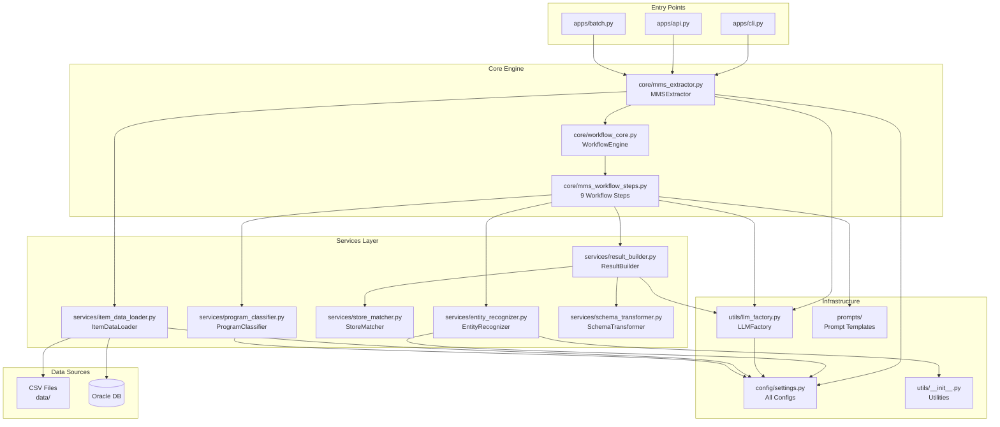

# MMS Extractor - Agent Quick Reference

> **사용 목적**: Agent가 수정/개선/확장 작업 시 첫 번째로 참조하는 문서  
> **업데이트**: 2026-02-09
> **버전**: 1.1

---

## 🎯 빠른 의사결정 트리

```
작업 요청 받음
    ↓
┌─────────────────────────────────────────┐
│ 1. 어떤 종류의 작업인가?                │
└─────────────────────────────────────────┘
    ↓
    ├─ 추출 성능 개선 → [섹션 A: 성능 개선](#a-성능-개선-작업)
    ├─ 새 기능 추가 → [섹션 B: 기능 추가](#b-기능-추가-작업)
    ├─ 버그 수정 → [섹션 C: 버그 수정](#c-버그-수정-작업)
    ├─ 설정 변경 → [섹션 D: 설정 변경](#d-설정-변경-작업)
    └─ 리팩토링 → [섹션 E: 리팩토링](#e-리팩토링-작업)
```

---

## 📊 시스템 아키텍처 맵

### 핵심 데이터 흐름

```
[사용자 입력]
    ↓
[MMSExtractor.process_message()]
    ↓
[WorkflowEngine.run()] ← 9단계 순차 실행
    ↓
    ├─ 1. InputValidationStep
    ├─ 2. EntityExtractionStep ← EntityRecognizer
    ├─ 3. ProgramClassificationStep ← ProgramClassifier
    ├─ 4. ContextPreparationStep
    ├─ 5. LLMExtractionStep ← LLM (via LLMFactory)
    ├─ 6. ResponseParsingStep
    ├─ 7. ResultConstructionStep ← ResultBuilder
    ├─ 8. ValidationStep
    └─ 9. DAGExtractionStep (선택적)
    ↓
[결과 반환: ext_result, raw_result, prompts]
```

### 의존성 그래프



### 컴포넌트 책임 매트릭스

| 컴포넌트 | 주요 책임 | 의존하는 것 | 의존받는 것 |
|---------|----------|------------|------------|
| **MMSExtractor** | 전체 오케스트레이션 | WorkflowEngine, LLMFactory, ItemDataLoader, Config | CLI, API, Batch |
| **WorkflowEngine** | 단계 순차 실행 | WorkflowSteps | MMSExtractor |
| **EntityRecognizer** | 엔티티 추출 및 매칭 | Kiwi, item_pdf, llm, similarity_utils, Config | EntityExtractionStep |
| **ResultBuilder** | 최종 결과 구성 | StoreMatcher, SchemaTransformer, LLMFactory | ResultConstructionStep |
| **ProgramClassifier** | 프로그램 분류 | emb_model, pgm_pdf, Config | ProgramClassificationStep |
| **StoreMatcher** | 매장 매칭 | org_pdf, Config | ResultBuilder |
| **ItemDataLoader** | 상품 데이터 로딩 (별칭 규칙, case sensitivity 지원) | CSV/DB, Config | MMSExtractor |
| **LLMFactory** | LLM 모델 생성 | Config | MMSExtractor, ResultBuilder, WorkflowSteps |

---

## 🗂️ 파일 위치 빠른 참조

### 수정 빈도별 분류

#### 🔥 자주 수정 (성능 개선, 기능 추가)
```
prompts/
├── main_extraction_prompt.py        # 메인 추출 프롬프트
├── entity_extraction_prompt.py      # 엔티티 추출 프롬프트
└── dag_extraction_prompt.py         # DAG 추출 프롬프트

config/settings.py                    # 모든 설정 (임계값, 모델명 등)

services/
├── entity_recognizer.py             # 엔티티 인식 로직
└── result_builder.py                # 결과 구성 로직
```

#### ⚙️ 가끔 수정 (새 기능, 구조 변경)
```
core/
├── mms_workflow_steps.py            # Workflow 단계 구현
└── mms_extractor.py                 # 메인 추출기

utils/
├── llm_factory.py                   # LLM 생성 로직
├── similarity_utils.py              # 유사도 계산 (bigram pre-filtering 포함)
├── text_utils.py                    # 텍스트 전처리
├── nlp_utils.py                     # NLP 유틸리티
└── __init__.py                      # 유틸리티 함수
```

#### 🔒 거의 수정 안 함 (안정적인 인프라)
```
core/workflow_core.py                # Workflow 프레임워크
apps/                                # CLI, API, Batch
tests/                               # 테스트
```

---

## 📋 작업별 가이드

### A. 성능 개선 작업

#### A-1. 엔티티 추출 정확도 향상

**체크리스트**:
- [ ] 1. 현재 성능 측정 (샘플 메시지로 테스트)
- [ ] 2. 문제 원인 파악
  - Kiwi 형태소 분석 문제? → `services/entity_recognizer.py` 검토
  - 유사도 임계값 문제? → `config/settings.py` 조정
  - 프롬프트 문제? → `prompts/entity_extraction_prompt.py` 수정
- [ ] 3. 수정 적용
- [ ] 4. 성능 재측정 및 비교

**주요 파일**:
```python
# 1. 임계값 조정
config/settings.py
    → ProcessingConfig.entity_fuzzy_threshold (기본: 0.5)
    → ProcessingConfig.entity_similarity_threshold (기본: 0.2)

# 2. 추출 로직 개선
services/entity_recognizer.py
    → extract_entities_hybrid()  # 하이브리드 (Kiwi + Fuzzy + Sequence)
    → extract_entities_with_llm()     # LLM 기반
    → match_entities()              # 매칭 로직

# 3. 프롬프트 개선
prompts/entity_extraction_prompt.py
    → DETAILED_ENTITY_EXTRACTION_PROMPT
```

**테스트 방법**:
```bash
# CLI로 단일 메시지 테스트
python apps/cli.py --message "테스트 메시지" --entity-matching-mode llm

# ONT 모드 테스트 (엔티티 추출 + DAG 최적화)
python apps/cli.py --message "테스트 메시지" --entity-extraction-context-mode ont --extract-entity-dag

# 배치 테스트
python apps/cli.py --batch-file test_messages.txt
```

#### A-2. LLM 응답 품질 향상

**체크리스트**:
- [ ] 1. 프롬프트 분석 (`prompts/main_extraction_prompt.py`)
- [ ] 2. Few-shot 예시 추가 또는 개선
- [ ] 3. 시스템 메시지 조정
- [ ] 4. Temperature/Top-p 조정 (`utils/llm_factory.py`)

**주요 파일**:
```python
# 1. 메인 프롬프트
prompts/main_extraction_prompt.py
    → MAIN_EXTRACTION_PROMPT_TEMPLATE

# 2. LLM 설정
utils/llm_factory.py
    → create_llm()  # temperature, max_tokens 조정

# 3. 응답 파싱
core/mms_workflow_steps.py
    → ResponseParsingStep.execute()
```

---

### B. 기능 추가 작업

#### B-1. 새로운 엔티티 타입 추가 (예: "이벤트")

**단계별 가이드**:

```python
# STEP 1: 프롬프트에 이벤트 추출 지시 추가
# 파일: prompts/main_extraction_prompt.py

# 기존 스키마에 추가
"""
{
    "title": "...",
    "product": [...],
    "event": [  # ← 새로 추가
        {
            "event_name": "이벤트명",
            "event_period": "기간",
            "event_benefit": "혜택"
        }
    ]
}
"""

# STEP 2: WorkflowState에 필드 추가
# 파일: core/workflow_core.py

@dataclass
class WorkflowState:
    # 기존 필드들...
    events: List[Dict[str, Any]] = field(default_factory=list)  # ← 추가

# STEP 3: 파싱 로직 추가
# 파일: core/mms_workflow_steps.py → ResponseParsingStep

def execute(self, state: WorkflowState) -> WorkflowState:
    # JSON 파싱 후
    if 'event' in json_objects:
        state.events = json_objects['event']  # ← 추가

# STEP 4: 결과 구성에 포함
# 파일: services/result_builder.py → build_extraction_result()

def build_extraction_result(self, state: WorkflowState) -> Dict:
    result = {
        # 기존 필드들...
        "event": state.events  # ← 추가
    }
```

**테스트**:
```python
# 이벤트 포함 메시지로 테스트
test_msg = "[SKT] 5월 가정의 달 특별 이벤트! 전 요금제 10% 할인"
result = extractor.process_message(test_msg)
assert 'event' in result['ext_result']
```

#### B-2. 새로운 Workflow 단계 추가

**템플릿**:
```python
# 파일: core/mms_workflow_steps.py

class NewProcessingStep(WorkflowStep):
    """
    [단계 설명]
    
    - [책임 1]
    - [책임 2]
    """
    
    def __init__(self, dependency1, dependency2):
        """
        Args:
            dependency1: [설명]
            dependency2: [설명]
        """
        self.dep1 = dependency1
        self.dep2 = dependency2
    
    def execute(self, state: WorkflowState) -> WorkflowState:
        """단계 실행"""
        logger.info("🚀 [단계명] 시작")
        
        try:
            # 1. 입력 검증
            if not state.msg:
                logger.warning("입력 메시지 없음")
                return state
            
            # 2. 처리 로직
            result = self.dep1.process(state.msg)
            
            # 3. 상태 업데이트
            state.new_field = result
            
            logger.info(f"✅ [단계명] 완료: {len(result)}개 처리")
            
        except Exception as e:
            logger.error(f"❌ [단계명] 실패: {e}")
            state.add_error(str(e))
        
        return state
```

**등록**:
```python
# 파일: core/mms_extractor.py → __init__

# Workflow 단계 등록 (순서 중요!)
self.workflow_engine.add_step(InputValidationStep())
self.workflow_engine.add_step(EntityExtractionStep(entity_recognizer))
# ... 기존 단계들 ...
self.workflow_engine.add_step(NewProcessingStep(dep1, dep2))  # ← 추가
```

#### B-3. 새로운 LLM 모델 추가

**단계**:
```python
# STEP 1: Config에 모델 정보 추가
# 파일: config/settings.py

@dataclass
class ModelConfig:
    # 기존 모델들...
    new_model_name: str = "gpt-4o-mini"  # ← 추가

# STEP 2: LLMFactory에 매핑 추가
# 파일: utils/llm_factory.py

def create_llm(self, model_name: str):
    """LLM 모델 생성"""
    
    model_mapping = {
        'ax': 'gpt-4-turbo',
        'gpt': 'gpt-4o',
        'gen': 'gemini-1.5-pro',
        'new': 'gpt-4o-mini',  # ← 추가
    }
    
    # 나머지 로직은 동일

# STEP 3: 테스트
# CLI에서 새 모델 사용
python apps/cli.py --llm-model new --message "테스트"
```

---

### C. 버그 수정 작업

#### C-1. 버그 위치 파악 전략

**로그 분석**:
```bash
# 최근 로그 확인
tail -f logs/mms_extractor.log

# 에러 검색
grep "ERROR" logs/mms_extractor.log
grep "❌" logs/mms_extractor.log
```

**Workflow 단계별 디버깅**:
```python
# 각 단계의 실행 시간과 상태 확인
# WorkflowEngine.run()이 자동으로 로깅함

# 출력 예시:
# ✅ InputValidationStep 완료 (0.01초)
# ✅ EntityExtractionStep 완료 (2.35초)
# ❌ LLMExtractionStep 실패: Connection timeout
```

**일반적인 버그 패턴**:

| 증상 | 가능한 원인 | 확인할 파일 |
|------|------------|------------|
| 엔티티 추출 안 됨 | Kiwi 초기화 실패, 데이터 로드 실패 | `mms_extractor.py` → `_initialize_kiwi()`, `_load_data()` |
| LLM 호출 실패 | API 키 문제, 네트워크 오류 | `.env`, `utils/llm_factory.py` |
| JSON 파싱 오류 | LLM 응답 형식 불일치 | `mms_workflow_steps.py` → `ResponseParsingStep` |
| 결과 누락 | 필드 매핑 오류 | `services/result_builder.py` |
| 성능 저하 | 데이터 크기 증가, 임베딩 계산 | `services/entity_recognizer.py`, `utils/similarity_utils.py`, `services/program_classifier.py` |

#### C-2. 에러 처리 패턴

**권장 패턴**:
```python
# ✅ 좋은 예: 구체적인 에러 처리
try:
    result = process_data(input)
except ValueError as e:
    logger.error(f"입력 값 오류: {e}. 입력: {input}")
    return default_value
except KeyError as e:
    logger.error(f"필수 키 누락: {e}. 사용 가능한 키: {data.keys()}")
    return default_value
except Exception as e:
    logger.error(f"예상치 못한 오류: {e}")
    logger.error(f"상세: {traceback.format_exc()}")
    return default_value

# ❌ 나쁜 예: 모호한 에러 처리
try:
    result = process_data(input)
except Exception as e:
    logger.error(f"오류: {e}")
    return None
```

---

### D. 설정 변경 작업

#### D-1. 임계값 조정

**모든 임계값 위치**: `config/settings.py` → `ProcessingConfig`

```python
@dataclass
class ProcessingConfig:
    # 엔티티 인식 임계값
    entity_fuzzy_threshold: float = 0.5           # Fuzzy 매칭
    entity_similarity_threshold: float = 0.2      # Sequence 유사도
    entity_combined_similarity_threshold: float = 0.2  # 결합 유사도
    entity_high_similarity_threshold: float = 1.0      # 고유사도 필터
    entity_llm_fuzzy_threshold: float = 0.6       # LLM 엔티티 추출
    
    # 매장 매칭 임계값
    store_matching_threshold: float = 0.5         # 매장명 매칭
    
    # 병렬 처리 임계값
    parallel_fuzzy_threshold: float = 0.5         # 기본 Fuzzy 임계값
```

**조정 가이드**:
- **높이면**: 정확도 ↑, 재현율 ↓ (엄격)
- **낮추면**: 정확도 ↓, 재현율 ↑ (관대)

#### D-2. 모델 변경

```python
# config/settings.py

@dataclass
class ModelConfig:
    # LLM 모델
    default_llm_model: str = "ax"  # ax, gpt, gen, cld
    
    # 임베딩 모델
    embedding_model_path: str = "./models/embedding_model"
    
    # Temperature 설정
    llm_temperature: float = 0.0
    llm_max_tokens: int = 4096
```

---

### E. 리팩토링 작업

#### E-1. 서비스 분리 패턴 (최근 예시: ItemDataLoader)

**Before (197줄 메서드)**:
```python
# core/mms_extractor.py
def _load_item_data(self):
    # 1. 데이터 로드 (30줄)
    # 2. 전처리 (20줄)
    # 3. 별칭 처리 (70줄)
    # 4. 필터링 (30줄)
    # 5. 메타데이터 추가 (47줄)
```

**After (서비스 분리)**:
```python
# services/item_data_loader.py
class ItemDataLoader:
    def load_raw_data(self) -> pd.DataFrame: ...
    def normalize_columns(self, df) -> pd.DataFrame: ...
    def apply_cascading_alias_rules(self, df) -> pd.DataFrame: ...
    def filter_and_clean(self, df) -> pd.DataFrame: ...
    def load_and_prepare_items(self) -> pd.DataFrame: ...  # 전체 파이프라인

# core/mms_extractor.py (33줄로 축소)
def _load_item_data(self):
    loader = ItemDataLoader(...)
    self.item_pdf_all = loader.load_and_prepare_items()
```

**리팩토링 체크리스트**:
- [ ] 단일 책임 원칙: 각 메서드가 하나의 일만 하는가?
- [ ] 재사용성: 다른 곳에서도 사용 가능한가?
- [ ] 테스트 용이성: 독립적으로 테스트 가능한가?
- [ ] 의존성 명시: 생성자로 의존성 주입하는가?

---

## 🔍 디버깅 체크리스트

### 문제 발생 시 확인 순서

1. **로그 확인**
   ```bash
   tail -100 logs/mms_extractor.log
   ```

2. **설정 확인**
   ```python
   from config.settings import *
   print(f"LLM Model: {MODEL_CONFIG.default_llm_model}")
   print(f"Entity Threshold: {PROCESSING_CONFIG.entity_fuzzy_threshold}")
   ```

3. **데이터 로드 확인**
   ```python
   extractor = MMSExtractor()
   print(f"Item count: {len(extractor.item_pdf_all)}")
   print(f"Program count: {len(extractor.pgm_pdf)}")
   ```

4. **Workflow 단계별 확인**
   - 각 단계의 로그 메시지 확인
   - `state.get_history()` 검토

5. **LLM 응답 확인**
   ```python
   result = extractor.process_message(msg)
   print(result['prompts'])  # 사용된 프롬프트 확인
   ```

---

## 📝 코딩 컨벤션

### 로깅 가이드

```python
# 단계 시작
logger.info("🚀 [작업명] 시작")

# 성공
logger.info(f"✅ [작업명] 완료: {count}개 처리")

# 경고
logger.warning(f"⚠️ [경고 내용]")

# 에러
logger.error(f"❌ [작업명] 실패: {error}")
logger.error(f"상세: {traceback.format_exc()}")

# 디버그 (상세 정보)
logger.debug(f"중간 결과: {intermediate_data}")
```

### 타입 힌트

```python
# ✅ 필수: 함수 시그니처
def process_message(self, message: str, message_id: str = '#') -> Dict[str, Any]:
    pass

# ✅ 권장: 복잡한 타입
from typing import List, Dict, Optional, Union

def extract_entities(self, 
                    text: str, 
                    mode: str = 'llm') -> List[Dict[str, Any]]:
    pass
```

### Docstring 템플릿

```python
def method_name(self, arg1: str, arg2: int = 0) -> Dict[str, Any]:
    """
    [한 줄 요약]
    
    [상세 설명 - 선택사항]
    
    Args:
        arg1: [설명]
        arg2: [설명] (기본값: 0)
    
    Returns:
        dict: [반환값 설명]
        
    Raises:
        ValueError: [발생 조건]
        
    Example:
        >>> result = obj.method_name("test", 5)
        >>> print(result)
    """
```

---

## 🚀 빠른 시작 가이드

### 로컬 테스트

```bash
# 1. 환경 설정
cd /Users/yongwook/workspace/AgenticWorkflow/mms_extractor_exp
source venv/bin/activate  # 가상환경 활성화 (있는 경우)

# 2. 단일 메시지 테스트
python apps/cli.py --message "[SKT] 테스트 메시지"

# 3. 배치 테스트
python apps/cli.py --batch-file data/reg_test.txt --max-workers 4

# 4. 특정 설정으로 테스트
python apps/cli.py \
    --message "테스트" \
    --llm-model gen \
    --entity-matching-mode llm \
    --extract-entity-dag
```

### 코드 수정 후 검증

```bash
# 1. 기본 동작 확인
python tests/test_workflow.py

# 2. 특정 서비스 테스트 (작성 필요)
python -m pytest tests/test_entity_recognizer.py

# 3. 전체 테스트
python -m pytest tests/
```

---

## 📚 추가 참고 문서

- **상세 가이드**: `docs/AGENT_DEVELOPMENT_GUIDE.md`
- **로깅 규칙**: `docs/LOGGING_GUIDELINES.md`
- **아키텍처**: (작성 예정) `docs/ARCHITECTURE.md`

---

## 🎯 작업 전 체크리스트

작업 시작 전 다음을 확인:

- [ ] 이 문서의 의존성 그래프 확인
- [ ] 관련 파일 위치 파악
- [ ] 기존 테스트 실행 (회귀 방지)
- [ ] 로그 레벨 설정 (디버깅 시 DEBUG)
- [ ] 변경 영향 범위 파악

작업 완료 후:

- [ ] 테스트 실행 및 통과
- [ ] 로그 메시지 적절성 확인
- [ ] 문서 업데이트 (필요시)
- [ ] Git 커밋 (명확한 메시지)

---

*최종 업데이트: 2026-02-09*
*다음 업데이트 예정: 주요 구조 변경 시*
