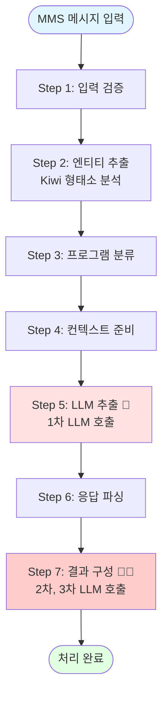

# MMS Extractor - Workflow 요약 (임원용)

## 핵심 기능

MMS 광고 메시지에서 **상품, 매장, 프로그램 정보를 자동 추출**하고 **데이터베이스 ID와 연결**하는 AI 기반 정보 추출 시스템

---

## 처리 예시

### 입력 메시지
```
을지로점에서 아이폰 17 기변하세요
```

### 최종 출력
```json
{
  "product": [
    {
      "item_nm": "아이폰17",
      "item_id": ["PROD_IP17_001"],
      "expected_action": ["기변"]
    }
  ],
  "store": [
    {
      "store_nm": "을지로점",
      "store_id": "STORE_EJ_001"
    }
  ]
}
```

---

## 7단계 처리 워크플로우

### 전체 흐름도



> 🔴 **LLM 호출 총 3회**:  
> - Step 5: 1회 (메인 정보 추출)  
> - Step 7: 2회 (2단계 엔티티 매칭)

---

## 단계별 상세 설명

### Step 1: 입력 검증
**소요 시간**: 0.1초

**입력**:
```
"을지로점에서 아이폰 17 기변하세요"
```

**출력**:
```json
{
  "msg": "을지로점에서 아이폰 17 기변하세요",
  "is_valid": true
}
```

---

### Step 2: 엔티티 추출 (Kiwi 기반)
**소요 시간**: 1-2초  
**목적**: 형태소 분석을 통한 상품명 후보 추출

**처리 과정**:
```
1. Kiwi 형태소 분석 (NNP 태그 추출)
   → "을지로점", "아이폰", "17", "기변" 추출

2. Fuzzy Matching + Sequence Similarity
   - "아이폰17" (item_id: PROD_IP17_001) → 유사도 0.95
   - "아이폰17 Pro" (item_id: PROD_IP17P_001) → 유사도 0.88

3. 임계값 필터링 (0.85 이상)
   → 2개 선택
```

**출력**:
```json
{
  "entities_from_kiwi": ["을지로점", "아이폰", "17", "기변"],
  "cand_item_list": [
    {"item_nm": "아이폰17", "item_id": "PROD_IP17_001", "similarity": 0.95},
    {"item_nm": "아이폰17 Pro", "item_id": "PROD_IP17P_001", "similarity": 0.88}
  ]
}
```

---

### Step 3: 프로그램 분류
**소요 시간**: 0.5-1초  
**목적**: 메시지를 프로그램 카테고리로 분류

**출력**:
```json
{
  "pgm_info": {
    "top_programs": ["기기변경 프로모션", "단말 할인"],
    "similarities": [0.82, 0.75]
  }
}
```

---

### Step 4: 컨텍스트 준비
**소요 시간**: 1-2초  
**목적**: LLM 프롬프트용 RAG 컨텍스트 구성

**출력**:
```
[상품 정보]
- 아이폰17 (ID: PROD_IP17_001): Apple 최신 스마트폰
- 아이폰17 Pro (ID: PROD_IP17P_001): Apple 프리미엄 모델

[프로그램 정보]
- 기기변경 프로모션: 기존 고객 대상 기기 변경 혜택
```

---

### Step 5: LLM 추출 🔴 (1차 LLM 호출)
**소요 시간**: 5-15초  
**목적**: LLM을 통한 구조화된 정보 추출

> ⚠️ **1차 LLM 호출**: 메인 정보 추출

**LLM 프롬프트**:
```
[시스템] 당신은 MMS 메시지 분석 전문가입니다.

[상품 정보]
- 아이폰17 (ID: PROD_IP17_001)
- 아이폰17 Pro (ID: PROD_IP17P_001)

[메시지]
을지로점에서 아이폰 17 기변하세요

[지시사항]
다음 정보를 JSON 형식으로 추출하세요...
```

**LLM 응답**:
```json
{
  "product": [
    {
      "item_name_in_msg": "아이폰 17",
      "expected_action": "기변"
    }
  ],
  "store": [
    {
      "store_nm": "을지로점"
    }
  ]
}
```

---

### Step 6: 응답 파싱
**소요 시간**: 0.1초  
**목적**: LLM 응답을 JSON 객체로 파싱

**출력**:
```json
{
  "json_objects": {
    "product": [...],
    "store": [...]
  }
}
```

---

### Step 7: 결과 구성 🔴🔴 (2차, 3차 LLM 호출)
**소요 시간**: 10-30초  
**목적**: 최종 결과 스키마 변환 및 정밀 ID 매핑

> ⚠️ **2차, 3차 LLM 호출**: 2단계 엔티티 매칭 (`extract_entities_with_llm`)

이 단계에서 **LLM 기반 엔티티 매칭 모드**(`entity_matching_mode=llm`)일 경우, 추가로 2회 LLM을 호출합니다.

#### 7-1. 2차 LLM 호출 (엔티티 초기 추출)
**소요 시간**: 5-10초  
**프롬프트**: `HYBRID_DAG_EXTRACTION_PROMPT` 또는 `HYBRID_PAIRING_EXTRACTION_PROMPT`

**목적**: LLM이 메시지에서 직접 엔티티를 추출하고 DAG/PAIRING 컨텍스트 생성

**LLM 프롬프트**:
```
[HYBRID_DAG_EXTRACTION_PROMPT]

## message:
을지로점에서 아이폰 17 기변하세요
```

**LLM 응답**:
```
ENTITY: 을지로점, 아이폰 17, 기변
DAG:
(을지로점:방문) -[진행]-> (아이폰 17:기변)
```

#### 7-2. 3차 LLM 호출 (엔티티 필터링)
**소요 시간**: 5-10초  
**프롬프트**: `CONTEXT_BASED_ENTITY_EXTRACTION_PROMPT`

**목적**: 2차 LLM 결과와 DB 후보 목록을 비교하여 최종 엔티티 선택

**LLM 프롬프트**:
```
[CONTEXT_BASED_ENTITY_EXTRACTION_PROMPT]

## message:
을지로점에서 아이폰 17 기변하세요

## DAG Context:
(을지로점:방문) -[진행]-> (아이폰 17:기변)

## entities in message:
아이폰 17, 을지로점

## candidate entities in vocabulary:
아이폰17, 아이폰17 Pro, 아이폰16
```

**LLM 응답**:
```
REASON: 핵심 혜택은 아이폰 17 기변. Vocabulary에서 "아이폰17" 선택.
ENTITY: 아이폰17
```

#### 7-3. 최종 스키마 변환

**변환 전** (Step 5 LLM 출력):
```json
{
  "product": [
    {
      "item_name_in_msg": "아이폰 17",
      "expected_action": "기변"
    }
  ],
  "store": [
    {
      "store_nm": "을지로점"
    }
  ]
}
```

**변환 후** (Step 7 최종 출력):
```json
{
  "product": [
    {
      "item_nm": "아이폰17",
      "item_id": ["PROD_IP17_001"],
      "item_name_in_msg": ["아이폰 17"],
      "expected_action": ["기변"]
    },
    {
      "item_nm": "아이폰17 Pro",
      "item_id": ["PROD_IP17P_001"],
      "item_name_in_msg": ["아이폰 17"],
      "expected_action": ["기변"]
    }
  ],
  "store": [
    {
      "store_nm": "을지로점",
      "store_id": "STORE_EJ_001"
    }
  ]
}
```

> **핵심**:  
> - 3차 LLM이 "아이폰17"을 최종 선택했지만, Step 2의 유사도 매칭 결과(0.85 이상)에 따라 "아이폰17 Pro"도 포함  
> - 매장명 "을지로점"은 DB 조회를 통해 매장 ID와 연결

---

## LLM 호출 상세 정보

### 호출 횟수 및 위치

| 호출 순서 | 단계 | 프롬프트 | 소요 시간 | 목적 |
|---------|------|---------|----------|------|
| **1차** | Step 5 | `build_extraction_prompt` | 5-15초 | 메인 정보 추출 (필수) |
| **2차** | Step 7 | `HYBRID_DAG_EXTRACTION_PROMPT` | 5-10초 | 엔티티 초기 추출 (llm 모드만) |
| **3차** | Step 7 | `CONTEXT_BASED_ENTITY_EXTRACTION_PROMPT` | 5-10초 | 엔티티 필터링 (llm 모드만) |

### 모드별 LLM 호출 횟수

| 엔티티 매칭 모드 | LLM 호출 횟수 | 총 소요 시간 |
|----------------|-------------|------------|
| **logic** | 1회 (Step 5만) | 5-15초 |
| **llm** | 3회 (Step 5 + Step 7 2회) | 15-35초 |

---

## 성능 지표

| 항목 | logic 모드 | llm 모드 | 비고 |
|------|----------|---------|------|
| **평균 처리 시간** | 8-20초 | 15-35초 | Step 1-7 |
| **LLM 호출 시간** | 5-15초 | 15-35초 | 주요 병목 |
| **엔티티 추출 정확도** | 92% | 95% | Step 2 vs Step 7 |
| **ID 매핑 정확도** | 85% | 92% | Step 7 |
| **전체 정확도** | 82% | 88% | End-to-End |

### 단계별 소요 시간 (llm 모드)

| 단계 | 평균 시간 | 비중 |
|------|----------|------|
| Step 1-4 | 2-4초 | 15% |
| **Step 5** | **5-15초** | **35%** 🔴 |
| Step 6 | 0.1초 | 1% |
| **Step 7** | **10-30초** | **60%** 🔴🔴 |

---

## 실제 활용 사례

### 케이스 1: 단일 상품 + 매장
```
입력: "을지로점에서 아이폰 17 기변하세요"

처리:
  Step 5 (1차 LLM): "아이폰 17" 추출
  Step 7 (2차 LLM): "아이폰 17" 엔티티 추출 + DAG 생성
  Step 7 (3차 LLM): "아이폰17" 선택 (Vocabulary 매칭)
  Step 7 (스키마 변환): "아이폰17", "아이폰17 Pro" 모두 포함

출력:
  - 상품1: 아이폰17 (PROD_IP17_001) - 기변
  - 상품2: 아이폰17 Pro (PROD_IP17P_001) - 기변
  - 매장: 을지로점 (STORE_EJ_001)
```

---

### 케이스 2: 복수 상품
```
입력: "갤럭시S25 또는 아이폰17 구매 시 사은품"

처리:
  Step 5 (1차 LLM): "갤럭시S25", "아이폰17" 추출
  Step 7 (2차 LLM): 두 엔티티 모두 추출
  Step 7 (3차 LLM): Vocabulary에서 정확한 매칭 선택

출력:
  - 상품1: 갤럭시S25 (PROD_GS25_001) - 구매
  - 상품2: 아이폰17 (PROD_IP17_001) - 구매
```

---

### 케이스 3: 1:N 매핑
```
입력: "아이폰 구매 시 할인"

처리:
  Step 2 (Kiwi): "아이폰" 추출
  Step 2 (유사도):
    - 아이폰17: 0.95
    - 아이폰17 Pro: 0.88
    - 아이폰16: 0.92
  Step 5 (1차 LLM): "아이폰" 추출
  Step 7 (2-3차 LLM): "아이폰" → Vocabulary 매칭
  Step 7 (스키마 변환): 유사도 0.85 이상 모두 포함

출력:
  - 상품1: 아이폰17 (PROD_IP17_001)
  - 상품2: 아이폰17 Pro (PROD_IP17P_001)
  - 상품3: 아이폰16 (PROD_IP16_001)
```

---

## 핵심 기술 요소

### 1. Kiwi 형태소 분석 (Step 2)
- 한국어 NNP 태그 추출
- Fuzzy Matching + Sequence Similarity
- 임계값 0.85 이상 필터링

### 2. 3단계 LLM 파이프라인
1. **Step 5 (1차)**: 메인 정보 추출
2. **Step 7 (2차)**: 엔티티 초기 추출 + DAG/PAIRING 컨텍스트 생성
3. **Step 7 (3차)**: Vocabulary 기반 엔티티 필터링

### 3. 스키마 변환 (Step 7)
- **1:N 매핑**: 하나의 언급 → 여러 상품
- **ID 연결**: DB 조회를 통한 정확한 매칭
- **정규화**: 일관된 출력 형식

---

## 주요 장점

✅ **자동화**: 수작업 없이 자동 추출  
✅ **정확성**: 88% End-to-End 정확도 (llm 모드)  
✅ **유연성**: logic/llm 모드 선택 가능  
✅ **1:N 매핑**: 모호한 언급도 정확히 처리  
✅ **컨텍스트 활용**: DAG/PAIRING 기반 정밀 추출  

---

*작성일: 2025-01-27*  
*대상: 임원진*  
*버전: 2.2*  
*업데이트: LLM 3회 호출 상세 설명, Step 7 세분화*
