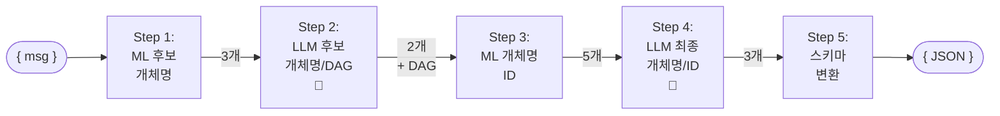

# 메시지 분석기 Workflow 플로우차트

이 문서는 메시지 분석기의 전체 워크플로우를 시각화한 플로우차트를 제공합니다.

---

## 세로형 플로우차트 (상세 입출력 포함)


---

## 가로형 플로우차트 (상세 입출력 포함)


---

## 간소화된 세로형 플로우차트


---

## 간소화된 가로형 플로우차트



---

## 범례

### 도형 의미 (표준 플로우차트 규칙)
- **둥근 사각형 `([ ])`**: 데이터/입출력 (JSON 형태)
- **사각형 `[ ]`**: 프로세스/처리 단계
- **🔴**: LLM 호출 단계 표시

---

## 주요 특징

### 데이터 흐름 (5단계)
1. **Step 1**: MMS 메시지 → 3개 후보 개체명 (아이폰 17, 을지로점, 기변)
2. **Step 2** 🔴: 3개 후보 → 2개 추출 + DAG (아이폰 17, 을지로점)
3. **Step 3**: 2개 개체명 → 5개 개체명 + ID 매칭 (아이폰 17, 17 프로, 16, 16 프로, 을지로점)
4. **Step 4** 🔴: 5개 후보 ID → 최종 3개 선택 (아이폰 17, 17 프로, 을지로점)
5. **Step 5**: 3개 최종 선택 → JSON 스키마 (product: 2개, store: 1개)

### LLM 호출
- **총 2회**: Step 2, Step 4
- **Step 2**: 후보 개체명 추출 및 DAG 생성
- **Step 4**: 최종 개체명 및 ID 선택

### JSON 데이터 구조
```json
// 입력
{ "msg": "신학기에 을지로점에서 아이폰 17로 기변하세요" }

// Step 1 출력
{ "candidates": ["아이폰 17", "을지로점", "기변"] }

// Step 2 출력
{ 
  "entities": ["아이폰 17", "을지로점"],
  "dag": "(을지로점:방문)-[방문하면]→(아이폰 17:기변)"
}

// Step 3 출력
{ 
  "matches": [
    { "name": "아이폰 17", "id": "PROD_IP17_001" },
    { "name": "아이폰 17 프로", "id": "PROD_IP17P_001" },
    { "name": "아이폰 16", "id": "PROD_IP16_001" },
    { "name": "아이폰 16 프로", "id": "PROD_IP16P_001" },
    { "name": "을지로점", "id": "STORE_EJ_001" }
  ]
}

// Step 4 출력
{ 
  "selected": [
    { "name": "아이폰 17", "id": "PROD_IP17_001" },
    { "name": "아이폰 17 프로", "id": "PROD_IP17P_001" },
    { "name": "을지로점", "id": "STORE_EJ_001" }
  ]
}

// Step 5 출력 (최종)
{
  "product": [
    { "item_nm": "아이폰 17", "item_id": ["PROD_IP17_001"] },
    { "item_nm": "아이폰 17 프로", "item_id": ["PROD_IP17P_001"] }
  ],
  "store": [
    { "store_nm": "을지로점", "store_id": "STORE_EJ_001" }
  ]
}
```

---

*작성일: 2026-01-28*
*최종 업데이트: 2026-02-14*
*버전: 2.5*
*참고: 이 문서는 핵심 데이터 흐름을 시각화하며, 실제 구현은 11단계 Workflow로 구성됨*
