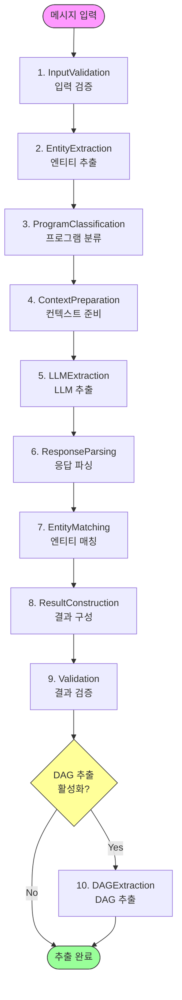

# MMS Extractor - Workflow 가이드

## 📋 목차

1. [Workflow 개요](#workflow-개요)
2. [단계별 상세 가이드](#단계별-상세-가이드)
3. [상태 관리](#상태-관리)
4. [에러 처리](#에러-처리)
5. [커스터마이징](#커스터마이징)

---

## Workflow 개요

MMS Extractor는 11단계의 Workflow로 구성되어 있으며, 각 단계는 독립적으로 실행되고 `WorkflowState`를 통해 데이터를 주고받습니다. 각 단계는 `should_execute()` 메서드를 통해 조건부로 스킵될 수 있습니다.

### Workflow 순서도



### 전체 처리 시간

| 단계 | 평균 소요 시간 | 비고 |
|------|---------------|------|
| 1-3단계 | 1-2초 | 로컬 처리 (bigram 최적화 적용) |
| 4단계 | 1-2초 | RAG 컨텍스트 구성 |
| 5단계 | 5-15초 | **LLM API 호출 (병목)** |
| 6-8단계 | 1-5초 | 응답 파싱 + 엔티티 추출 + 매칭 |
| 9-10단계 | 1-2초 | 결과 구성 + 검증 |
| 11단계 | 5-10초 | LLM API 호출 (선택적) |
| **전체** | **10-25초** | DAG 포함 시 |

---

## 단계별 상세 가이드

### 1. InputValidationStep

**목적**: 입력 메시지 검증 및 전처리

**입력**:
- `state.mms_msg`: 원본 MMS 메시지 (str)
- `state.extractor`: MMSExtractor 인스턴스

**처리 로직**:
```python
1. 메시지 존재 여부 확인
2. 텍스트 정규화 (공백 제거, 소문자 변환 등)
3. 추출기 설정 로깅
```

**출력**:
- `state.msg`: 전처리된 메시지 (str)

**에러 처리**:
- 빈 메시지 → `state.is_fallback = True`
- 에러 메시지 → `state.error_message`

**사용 예시**:
```python
# 정상 케이스
state.mms_msg = "[광고] 아이폰 구매 시 최대 20만원 할인"
# → state.msg = "[광고] 아이폰 구매 시 최대 20만원 할인"

# 에러 케이스
state.mms_msg = ""
# → state.is_fallback = True
# → state.error_message = "메시지가 비어있습니다"
```

---

### 2. EntityExtractionStep

**목적**: Kiwi 형태소 분석기 또는 LLM을 사용한 엔티티 추출

**입력**:
- `state.msg`: 전처리된 메시지
- `state.extractor.entity_recognizer`: EntityRecognizer 서비스

**처리 로직**:
```python
if entity_extraction_mode == 'logic':
    # Kiwi 형태소 분석기 사용
    entities = recognizer.extract_entities_hybrid(msg)
elif entity_extraction_mode == 'llm':
    # LLM 기반 추출
    entities = recognizer.extract_entities_with_llm(msg)
```

**출력**:
- `state.entities_from_kiwi`: 추출된 엔티티 리스트
  ```python
  [
      {
          "item_nm": "아이폰17",
          "item_id": "PROD123",
          "item_name_in_msg": "아이폰",
          "similarity": 0.95
      },
      ...
  ]
  ```

**협력 객체**:
- `EntityRecognizer`: 엔티티 추출 및 매칭
- `Kiwi`: 형태소 분석 (logic 모드)
- `LLM`: 엔티티 추출 (llm 모드)

**주의사항**:
- Kiwi 모드: 사전에 등록된 상품만 추출 가능
- LLM 모드: 더 유연하지만 API 비용 발생

---

### 3. ProgramClassificationStep

**목적**: 메시지를 프로그램 카테고리로 분류

**입력**:
- `state.msg`: 전처리된 메시지
- `state.extractor.program_classifier`: ProgramClassifier 서비스

**처리 로직**:
```python
1. 메시지 임베딩 생성
2. 프로그램 클루 임베딩과 코사인 유사도 계산
3. 상위 N개 후보 프로그램 선택
```

**출력**:
- `state.pgm_info`: 프로그램 분류 정보
  ```python
  {
      "pgm_cand_info": "프로그램1 : 클루1\n프로그램2 : 클루2",
      "similarities": [0.85, 0.72, ...],
      "pgm_pdf_tmp": DataFrame
  }
  ```

**협력 객체**:
- `ProgramClassifier`: 프로그램 분류
- `SentenceTransformer`: 임베딩 모델

**성능 최적화 (2026-02-09)**:
- Bigram pre-filtering으로 Fuzzy Matching 대상 94.7% 감소 (904K → 48K)
- 100K 미만 비교 시 단일 프로세스로 joblib IPC 오버헤드 제거
- Step 2 전체: 16.2초 → 1.5초 (11x 개선)

**성능**:
- 평균 처리 시간: 0.5-1초
- 임베딩 캐싱으로 최적화

---

### 4. ContextPreparationStep

**목적**: RAG (Retrieval-Augmented Generation) 컨텍스트 준비

**입력**:
- `state.msg`: 전처리된 메시지
- `state.entities_from_kiwi`: 추출된 엔티티
- `state.pgm_info`: 프로그램 정보

**처리 로직**:
```python
# RAG 컨텍스트는 ContextPreparationStep에서 자동으로 구성됩니다
# - 광고 분류 정보 (_build_ad_classification_rag_context)
# - 제품 정보 (_build_product_rag_context)
# - NLP 모드 제품 요소 (_build_nlp_product_element)
```

**출력**:
- `state.rag_context`: RAG 컨텍스트 (str)
  ```
  [상품 정보]
  - 아이폰17 (ID: PROD123): 최신 스마트폰
  - 갤럭시S25 (ID: PROD456): 삼성 플래그십
  
  [프로그램 정보]
  - 단말 할인 프로그램: 최대 20만원 할인
  ```

**컨텍스트 모드**:
- `dag`: DAG 형식 컨텍스트 (기본)
- `pairing`: 페어링 형식 컨텍스트
- `none`: 컨텍스트 없음
- `ont`: 온톨로지 기반 컨텍스트 (엔티티 타입, 관계 포함)
- `typed`: 6-type 엔티티 추출 (Product, Store, Program, Channel, Purpose, Other)

---

### 5. LLMExtractionStep

**목적**: LLM을 사용한 정보 추출

**입력**:
- `state.msg`: 전처리된 메시지
- `state.rag_context`: RAG 컨텍스트
- `state.pgm_info`: 프로그램 정보

**처리 로직**:
```python
1. 프롬프트 구성 (메시지 + 컨텍스트 + 지시사항)
2. LLM API 호출
3. 응답 수신
```

**출력**:
- `state.llm_response`: LLM 응답 (str, JSON 형식)

**프롬프트 구조**:
```
시스템 메시지: 역할 정의
↓
RAG 컨텍스트: 참조 정보
↓
프로그램 정보: 분류 결과
↓
메시지: 분석 대상
↓
지시사항: 추출 요구사항
```

**성능**:
- **평균 처리 시간: 5-15초** (가장 큰 병목)
- 모델별 차이:
  - AX: 5-8초
  - GPT-4: 8-12초
  - Claude: 10-15초

---

### 6. ResponseParsingStep

**목적**: LLM 응답을 JSON 객체로 파싱

**입력**:
- `state.llm_response`: LLM 응답 (str)

**처리 로직**:
```python
1. JSON 블록 추출 (```json ... ``` 제거)
2. JSON 파싱
3. 배열 여부 확인 및 정규화
```

**출력**:
- `state.json_objects`: 파싱된 JSON 객체 리스트
  ```python
  [
      {
          "title": "제목",
          "product": [...],
          "channel": [...],
          ...
      }
  ]
  ```

**에러 처리**:
- JSON 파싱 실패 → 빈 리스트 반환
- 잘못된 형식 → 로그 기록 후 계속 진행

---

### 7. EntityContextExtractionStep

**목적**: 메시지에서 엔티티와 컨텍스트 추출 (Stage 1)

**조건부 스킵**: `should_execute()` → `has_error` 또는 `entity_matching_mode='logic'`이면 스킵

**⚠️ 중요**: `--entity-matching-mode logic` 사용 시 이 단계는 **완전히 건너뜁니다** (`--extraction-engine` 설정 무시)

**입력**:
- `state.msg`: 원본 메시지
- `state.entities_from_kiwi`: Kiwi 추출 엔티티
- `state.json_objects`: 파싱된 JSON 객체 (product items)
- `extraction_engine`: 추출 엔진 ('default' 또는 'langextract')
- `use_external_candidates`: 외부 후보 엔티티 사용 여부

**처리 로직 (두 가지 방식)**:

**A. langextract 방식** (extraction_engine='langextract'):
```python
1. extract_mms_entities(msg) 호출
2. 6-type 엔티티 추출 (Product, Store, Program, Channel, Purpose, Other)
3. Channel/Purpose 제외, 2글자 이상만 포함
4. state.extracted_entities 설정:
   {
       'entities': [...],
       'context_text': "product1(Product), store1(Store), ..."
       'entity_types': {},
       'relationships': []
   }
```

**B. default 방식** (extraction_engine='default'):
```python
1. 외부 후보 구성 (use_external_candidates=True일 때):
   - external_cand = entities_from_kiwi + primary_llm_extracted_entities
2. entity_recognizer._extract_entities_stage1() 호출
   - context_mode에 따라 다른 프롬프트 사용 (dag, ont, typed, pairing, none)
3. state.extracted_entities 설정:
   {
       'entities': [...],
       'context_text': "...",
       'entity_types': {...},  # ont/typed 모드만
       'relationships': [...]  # ont 모드만
   }
```

**출력**:
- `state.extracted_entities`: 추출된 엔티티 및 컨텍스트
  ```python
  {
      'entities': ['아이폰17', '갤럭시S25'],
      'context_text': "아이폰17(Product), 갤럭시S25(Product)",
      'entity_types': {...},  # ont/typed 모드만
      'relationships': [...]  # ont 모드만
  }
  ```

**협력 객체**:
- `lx_extractor.extract_mms_entities`: LangExtract 기반 추출 (langextract 엔진)
- `entity_recognizer._extract_entities_stage1`: LLM 기반 추출 (default 엔진)

**CLI 옵션**:
```bash
# Default engine + LLM mode (Step 7 runs)
python apps/cli.py --message "광고 메시지" --entity-matching-mode llm

# LangExtract engine + LLM mode (Step 7 runs with langextract)
python apps/cli.py --extraction-engine langextract --entity-matching-mode llm --message "광고 메시지"

# Logic mode (Step 7 SKIPPED - extraction-engine ignored!)
python apps/cli.py --entity-matching-mode logic --message "광고 메시지"

# Disable external candidates
python apps/cli.py --no-external-candidates --message "광고 메시지"
```

**파라미터 우선순위**:
- `--entity-matching-mode=logic` → Step 7 스킵, `--extraction-engine` 무시됨
- `--entity-matching-mode=llm` → Step 7 실행, `--extraction-engine`에 따라 langextract/default 선택

---

### 8. VocabularyFilteringStep

**목적**: Stage 1에서 추출한 엔티티를 상품 DB와 매칭하여 item_id 부여 (Stage 2)

**조건부 스킵**: `should_execute()` → `has_error`, `is_fallback`, 또는 추출된 엔티티 없으면 스킵

**입력**:
- `state.extracted_entities`: Step 7에서 추출한 엔티티 및 컨텍스트
- `state.msg`: 원본 메시지
- `state.json_objects`: 파싱된 JSON 객체
- `entity_extraction_mode`: 매칭 모드 ('logic' 또는 'llm')

**처리 로직 (두 가지 모드)**:

**A. logic 모드**:
```python
1. Kiwi 엔티티 + product items 결합
2. entity_recognizer.extract_entities_with_fuzzy_matching() 호출
3. fuzzy + sequence 유사도 계산
4. 상위 매칭 결과 반환
```

**B. llm 모드**:
```python
1. extracted_entities에서 entities, context_text 추출
2. entity_recognizer._filter_with_vocabulary() 호출
   - 상품 DB와 유사도 매칭
   - 어휘 필터링 프롬프트 생성
   - LLM으로 최종 필터링
3. alias type 필터링 (non-expansion 타입 제거)
4. entity_recognizer.map_products_to_entities() 호출
5. 매칭 결과가 없으면 fallback (item_id='#')
```

**출력**:
- `state.matched_products`: 매칭된 상품 리스트
  ```python
  [
      {
          "item_nm": "아이폰17",
          "item_id": ["PROD_IP17_001"],
          "item_name_in_msg": ["아이폰 17"],
          "expected_action": ["기변"]
      }
  ]
  ```

**협력 객체**:
- `entity_recognizer._filter_with_vocabulary`: LLM 기반 필터링 (llm 모드)
- `entity_recognizer.extract_entities_with_fuzzy_matching`: 유사도 기반 매칭 (logic 모드)
- `entity_recognizer.map_products_to_entities`: 상품-엔티티 매핑

---

### 9. ResultConstructionStep

**목적**: 매칭된 상품 기반으로 최종 결과 조립

**입력**:
- `state.matched_products`: 매칭된 상품 (Step 7 출력)
- `state.json_objects`: 파싱된 JSON 객체
- `state.msg`: 원본 메시지
- `state.pgm_info`: 프로그램 정보

**처리 로직**:
```python
1. ResultBuilder.assemble_result() 호출
2. 채널 정보 추출 및 보강
3. 프로그램 매핑
4. Offer 객체 생성
5. entity_dag, message_id 첨부
```

**출력**:
- `state.final_result`: 최종 추출 결과
  ```python
  {
      "ext_result": {
          "title": "제목",
          "product": [...],
          "channel": [...],
          "pgm": [...],
          "offer": {...}
      },
      "raw_result": {...},
      "metadata": {...}
  }
  ```

**협력 객체**:
- `ResultBuilder`: 결과 조립 (`assemble_result()`)
- `StoreMatcher`: 매장 매칭
- `SchemaTransformer`: 스키마 변환

---

### 10. ValidationStep

**목적**: 추출 결과 검증

**입력**:
- `state.final_result`: 최종 결과

**처리 로직**:
```python
1. 필수 필드 존재 여부 확인
2. 데이터 타입 검증
3. 비즈니스 규칙 검증
```

**검증 항목**:
- ✅ `ext_result` 필드 존재
- ✅ `product`, `channel` 배열 타입
- ✅ 각 상품에 `item_nm`, `item_id` 존재

**출력**:
- 검증 통과 → 상태 유지
- 검증 실패 → 경고 로그 (계속 진행)

---

### 11. DAGExtractionStep (선택적)

**목적**: 엔티티 간 관계를 DAG (Directed Acyclic Graph)로 추출

**입력**:
- `state.msg`: 원본 메시지
- `state.extractor.extract_entity_dag`: DAG 추출 활성화 여부

**처리 로직**:
```python
if extract_entity_dag:
    1. DAG 추출 프롬프트 구성
    2. LLM API 호출
    3. DAG 텍스트 파싱
    4. NetworkX 그래프 생성
    5. Graphviz 다이어그램 생성
```

**출력**:
- `state.entity_dag`: DAG 엣지 리스트
  ```python
  [
      "(아이폰17:구매) -[획득]-> (캐시백:제공)",
      "(T world:접속) -[참여]-> (이벤트:진행)"
  ]
  ```

**다이어그램 생성**:
- 저장 위치: `./dag_images/dag_{message_id}.png`
- 형식: PNG 이미지

**성능**:
- 평균 처리 시간: 5-10초
- 선택적 기능이므로 비활성화 가능
- 모든 context mode에서 동일하게 fresh LLM call로 DAG 추출

---

## 상태 관리

### WorkflowState 구조

```python
@dataclass
class WorkflowState:
    # === 입력 데이터 ===
    mms_msg: str                    # 원본 메시지
    extractor: 'MMSExtractor'       # 추출기 인스턴스
    message_id: str = '#'           # 메시지 ID
    
    # === 중간 결과 (단계별 출력) ===
    msg: str = ""                   # 전처리된 메시지 (Step 1)
    entities_from_kiwi: List = field(default_factory=list)  # 엔티티 (Step 2)
    pgm_info: Dict = field(default_factory=dict)  # 프로그램 정보 (Step 3)
    rag_context: str = ""           # RAG 컨텍스트 (Step 4)
    llm_response: str = ""          # LLM 응답 (Step 5)
    json_objects: List[Dict] = field(default_factory=list)  # 파싱 결과 (Step 6)
    matched_products: List[Dict] = field(default_factory=list)  # 매칭된 상품 (Step 7)
    final_result: Dict = field(default_factory=dict)  # 최종 결과 (Step 8)
    entity_dag: List[str] = field(default_factory=list)  # DAG (Step 10)
    
    # === 메타데이터 ===
    is_fallback: bool = False       # 폴백 여부
    error_message: str = ""         # 에러 메시지
    processing_time: float = 0.0    # 처리 시간
    
    # === 헬퍼 메서드 ===
    def set(self, key: str, value: Any):
        """상태 필드 설정"""
        setattr(self, key, value)

    def get(self, key: str, default=None) -> Any:
        """상태 필드 조회"""
        return getattr(self, key, default)

    def has_error(self) -> bool:
        """에러 여부 확인"""
        return bool(self.error_message)
```

### 상태 전달 흐름

```
초기 상태 생성
    ↓
Step 1: msg 설정
    ↓
Step 2: entities_from_kiwi 설정 (스킵 가능: --skip-entity-extraction)
    ↓
Step 3: pgm_info 설정
    ↓
Step 4: rag_context 설정
    ↓
Step 5: llm_response 설정
    ↓
Step 6: json_objects 설정
    ↓
Step 7: matched_products 설정 (스킵 가능: 에러/폴백/상품없음)
    ↓
Step 8: final_result 설정
    ↓
Step 9: 검증 (상태 변경 없음)
    ↓
Step 10: entity_dag 설정 (선택적)
    ↓
최종 상태 반환
```

---

## 에러 처리

### 에러 처리 전략

각 단계는 독립적으로 에러를 처리하며, 치명적이지 않은 에러는 로그 기록 후 계속 진행합니다.

#### 1. 입력 검증 에러
```python
# InputValidationStep
if not msg or msg.strip() == "":
    state.is_fallback = True
    state.error_message = "메시지가 비어있습니다"
    return state  # 폴백 모드로 계속 진행
```

#### 2. LLM API 에러
```python
# LLMExtractionStep
try:
    response = llm.invoke(prompt)
except Exception as e:
    logger.error(f"LLM API 호출 실패: {e}")
    state.llm_response = "{}"  # 빈 JSON 반환
    state.is_fallback = True
    return state
```

#### 3. 파싱 에러
```python
# ResponseParsingStep
try:
    json_objects = json.loads(response)
except json.JSONDecodeError as e:
    logger.error(f"JSON 파싱 실패: {e}")
    state.json_objects = []  # 빈 리스트 반환
    return state
```

### 폴백 모드

`state.is_fallback = True`인 경우:
- 최소한의 결과 반환
- 메타데이터에 에러 정보 포함
- 사용자에게 재시도 권장

---

## 커스터마이징

### 새로운 단계 추가

**예시**: 감정 분석 단계 추가

#### 1. Step 클래스 구현
```python
# core/mms_workflow_steps.py
class SentimentAnalysisStep(WorkflowStep):
    """감정 분석 단계"""
    
    def __init__(self, sentiment_analyzer):
        self.analyzer = sentiment_analyzer
    
    def execute(self, state: WorkflowState) -> WorkflowState:
        logger.info("🎭 감정 분석 시작")
        
        # 감정 분석 수행
        sentiment = self.analyzer.analyze(state.msg)
        
        # 상태 업데이트
        state.set("sentiment", sentiment)
        
        logger.info(f"✅ 감정 분석 완료: {sentiment}")
        return state
```

#### 2. 서비스 생성 (선택적)
```python
# services/sentiment_analyzer.py
class SentimentAnalyzer:
    """감정 분석 서비스"""
    
    def analyze(self, text: str) -> Dict[str, float]:
        # 감정 분석 로직
        return {
            "positive": 0.7,
            "negative": 0.2,
            "neutral": 0.1
        }
```

#### 3. MMSExtractor에 등록
```python
# core/mms_extractor.py __init__
from services.sentiment_analyzer import SentimentAnalyzer

# 서비스 초기화
self.sentiment_analyzer = SentimentAnalyzer()

# Workflow에 단계 추가 (Step 3과 4 사이에 삽입)
self.workflow_engine.add_step(
    SentimentAnalysisStep(self.sentiment_analyzer),
    position=3  # Step 3 다음에 삽입
)
```

### 단계 순서 변경

```python
# 기본 순서
steps = [
    InputValidationStep(),
    EntityExtractionStep(),
    ProgramClassificationStep(),
    # ...
]

# 순서 변경 (예: 프로그램 분류를 엔티티 추출 전에)
steps = [
    InputValidationStep(),
    ProgramClassificationStep(),  # 순서 변경
    EntityExtractionStep(),
    # ...
]
```

### 단계 비활성화

```python
# 방법 1: 단계를 등록하지 않음
if not extract_entity_dag:
    # DAGExtractionStep 추가하지 않음
    pass

# 방법 2: should_execute() 오버라이드로 조건부 스킵
class EntityExtractionStep(WorkflowStep):
    def should_execute(self, state: WorkflowState) -> bool:
        if self.skip_entity_extraction:
            return False  # 워크플로우 히스토리에 "skipped"로 기록
        return not state.has_error()
```

---

## 모범 사례

### 1. 로깅
각 단계는 시작과 완료를 명확히 로깅합니다:
```python
logger.info("🚀 [단계명] 시작")
# 처리 로직
logger.info("✅ [단계명] 완료")
```

### 2. 에러 처리
치명적이지 않은 에러는 로그 후 계속 진행:
```python
try:
    result = process()
except Exception as e:
    logger.error(f"처리 실패: {e}")
    result = default_value
```

### 3. 상태 업데이트
명시적으로 상태를 업데이트:
```python
state.set("field_name", value)
# 또는
state.field_name = value
```

### 4. 타입 힌트
모든 메서드에 타입 힌트 추가:
```python
def execute(self, state: WorkflowState) -> WorkflowState:
    ...
```

---

*작성일: 2025-12-16*
*최종 업데이트: 2026-02-11*
*버전: 1.4*
*작성자: 신용욱 with Google Antigravity*
