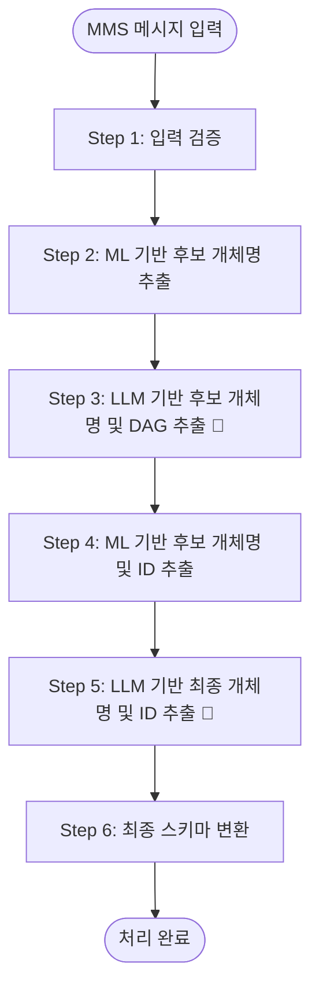

# 메시지 분석기 Workflow 요약

> **참고**: 이 문서는 개념적 데이터 흐름을 설명합니다.
> 실제 구현은 10단계 Workflow로 구성되어 있습니다.
> 상세 내용은 [WORKFLOW_GUIDE.md](./WORKFLOW_GUIDE.md)를 참조하세요.

---

## 핵심 기능

MMS 광고 메시지에서 **상품, 매장 정보를 자동 추출**하고 **데이터베이스 ID와 연결**하는 AI 기반 정보 추출 시스템

*최종 업데이트: 2026-02-09*

---

## 처리 예시

### 입력 메시지
```
신학기에 을지로점에서 아이폰 17 기변하세요
```

### 최종 출력
```json
{
  "product": [
    {
      "item_nm": "아이폰 17",
      "item_id": ["PROD_IP17_001"],
      "expected_action": ["기변"]
    },
    {
      "item_nm": "아이폰 17 프로",
      "item_id": ["PROD_IP17P_001"],
      "expected_action": ["기변"]
    }
  ],
  "store": [
    {
      "store_nm": "을지로점",
      "store_id": "STORE_EJ_001"
    }
  ]
}
```

---

## 전체 흐름도


---

> 🔴 **LLM 호출**: 총 2회 (Step 3, Step 5)  
> - **Step 3**: 후보 개체명 추출 및 DAG 생성  
> - **Step 5**: 최종 개체명 및 ID 선택

---

## 단계별 상세 설명

### Step 1: 입력 검증

**입력**:
```
"신학기에 을지로점에서 아이폰 17로 기변하세요"
```

**출력**:
```json
{
  "msg": "신학기에 을지로점에서 아이폰 17로 기변하세요",
  "is_valid": true
}
```

---


### Step 2: ML 기반 개체명 후보 추출
**목적**: LLM RAG 컨텍스트 생성용으로 ML 기법 및 형태소 분석을 통한 후보 개체명 추출

**입력**:
```
메시지: 신학기에 을지로점에서 아이폰 17로 기변하세요
```

**처리 과정**:

**1. NLP 형태소 분석**
```
→ "을지로점", "아이폰", "17", "기변" 추출
```

**2. Fuzzy Matching + Sequence Similarity으로 후보 개체명 추출 (사전 활용, 0.5 이상)**

| 메시지 내 개체명 | 사전 내 개체명 | 유사도 |
|--------------|-------------|-------|
| 아이폰 17 | 아이폰 17 | 1.0 |
| 아이폰 17 | 아이폰 17 프로 | 0.88 |
| 아이폰 17 | 아이폰 16 | 0.9 |
| 아이폰 17 | 아이폰 16 프로 | 0.82 |
| 을지로점 | 을지로점 | 1.0 |
| 기변 | 특가기변 | 0.5 |

**3. RAG 컨텍스트 구성**
```
→ 후보 상품 정보를 LLM 프롬프트용으로 준비
```

**출력**:
```
아이폰 17, 을지로점, 기변
```

---

### Step 3: LLM 기반 후보 개체명 및 DAG 추출 🔴
**목적**: LLM이 메시지에서 직접 후보 개체명을 추출하고 개체명간 관계를 DAG로 생성

**입력**:
```
메시지: 신학기에 을지로점에서 아이폰 17로 기변하세요
후보 개체명: 아이폰 17, 을지로점, 기변
```

**LLM 프롬프트**:
```
아래 메시지에서 후보 개체명 리스트를 참고하여 개체명을 추출하고 개체명간 관계를 DAG로 생성하세요.

## message:
신학기에 을지로점에서 아이폰 17로 기변하세요

## 후보 개체명 리스트:
[아이폰 17, 을지로점, 기변]

```

**LLM 응답**:
```
ENTITY: 아이폰 17, 을지로점
DAG:
(을지로점:방문) -[방문하면]-> (아이폰 17:기변)
```

**출력**:
```
추출 개체명: 아이폰 17, 을지로점
DAG 컨텍스트: (을지로점:방문) -[방문하면]-> (아이폰 17:기변)
```

---

### Step 4: ML 기반 후보 개체명 및 ID 추출
**목적**: LLM에서 추출한 후보명과 유사한 개체명 정보를 사전에서 선택

**입력**:
```
후보 개체명: 아이폰 17, 을지로점
```

**처리 과정**:

Step 3에서 LLM이 추출한 개체명을 기준으로 사전에서 Fuzzy Matching + Sequence Similarity를 통해 유사한 개체명 및 ID를 검색합니다.

**출력**:

| LLM 추출 개체명 | 사전 내 개체명 | 유사도 |
|--------------|-------------|-------|
| 아이폰 17 | 아이폰 17 | 1.0 |
| 아이폰 17 | 아이폰 17 프로 | 0.88 |
| 아이폰 17 | 아이폰 16 | 0.9 |
| 아이폰 17 | 아이폰 16 프로 | 0.82 |
| 을지로점 | 을지로점 | 1.0 |

---

### Step 5: LLM 기반 최종 개체명 및 ID 추출 🔴
**목적**: 후보 개체명과 DAG 컨텍스트를 참고하여 최종 개체명 및 ID 추출

**입력**:
```
메시지: 신학기에 을지로점에서 아이폰 17로 기변하세요
DAG Context: (을지로점:방문) -[방문하면]-> (아이폰 17:기변)
후보 개체명 및 ID:
  - 아이폰 17 (PROD_IP17_001)
  - 아이폰 17 프로 (PROD_IP17P_001)
  - 아이폰 16 (PROD_IP16_001)
  - 아이폰 16 프로 (PROD_IP16P_001)
  - 을지로점 (STORE_EJ_001)
```

**LLM 프롬프트**:
```
아래 메시지에서 DAG 컨텍스트와 후보 개체명을 참고하여 최종 개체명 및 ID를 추출하세요.

## message:
신학기에 을지로점에서 아이폰 17로 기변하세요

## DAG Context:
(을지로점:방문) -[방문하면]-> (아이폰 17:기변)

## candidate entities in vocabulary:
아이폰 17 (PROD_IP17_001), 아이폰 17 프로 (PROD_IP17P_001), 아이폰 16 (PROD_IP16_001), 아이폰 16 프로 (PROD_IP16P_001), 을지로점 (STORE_EJ_001) 
```

**LLM 응답**:
```
REASON: 핵심 내용은 을지로점을 방문하여 아이폰 17로 기변 유도
ENTITY: 아이폰 17 (PROD_IP17_001), 아이폰 17 프로 (PROD_IP17P_001), 을지로점 (STORE_EJ_001) 
```

**출력**:
```
최종 선택 개체명 및 ID:
  - 아이폰 17 (PROD_IP17_001)
  - 아이폰 17 프로 (PROD_IP17P_001)
  - 을지로점 (STORE_EJ_001)
```

---

### Step 6: 최종 스키마 변환
**목적**: 최종 결과 스키마 변환 및 ID 매핑

**입력**:
```
최종 선택 개체명 및 ID:
  - 아이폰 17 (PROD_IP17_001)
  - 아이폰 17 프로 (PROD_IP17P_001)
  - 을지로점 (STORE_EJ_001)
```

**출력**:
```json
{
  "product": [
    {
      "item_nm": "아이폰 17",
      "item_id": ["PROD_IP17_001"],
      "item_name_in_msg": ["아이폰 17"],
      "expected_action": ["기변"]
    },
    {
      "item_nm": "아이폰 17 프로",
      "item_id": ["PROD_IP17P_001"],
      "item_name_in_msg": ["아이폰 17"],
      "expected_action": ["기변"]
    }
  ],
  "store": [
    {
      "store_nm": "을지로점",
      "store_id": "STORE_EJ_001"
    }
  ]
}
```
